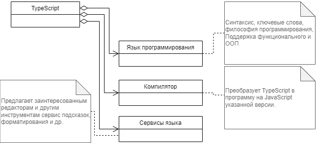

# TypeScript, начало

Кому потребовалось создание TypeScript? Чего ожидают от TypeScript-а разработчики? Чем он лучше чем &lt;впишите нужное имя&gt;?

В этом курсе мы постараемся ответить на эти и многие другие вопросы. Формально TypeScript это статически-**типизированный**, объектно-ориентированный, **компилируемый** язык программирования с глубокой **поддержкой инструментов** разработчика. Программы, написанные на TypeScript исполняются в любом контексте, где работает JavaScript. TypeScript разрабатывается как **open-source** проект.

TypeScript содержит три взаимосвязанные части

* Язык программирования
* Компилятор
* Сервис поддержки инструментов разработки.



## Компилятор

Возможность обнаружить ошибку до начала исполнения веб-приложения повышает производительность труда разработчика и качество кода. Без использования TypeScript определенную поддержку можно получить со стороны JSLint, который, все же не является заменой компилятору. В этом смысле наличие настоящего TypeScript компилятора является большим преимуществом

Браузеры играют в команде пользователей. Они предназначены для приятного просмотра веб страниц и делают все усилия, чтобы, по возможности, проигнорировать проблемы с JavaScript. Такое поведение среды исполнения не добавляет уверенности разработчику. TypeScript в свою очередь играет в команде разработки и помогает как можно раньше обнаружить потенциальные проблемы с кодом.

Согласитесь, компилятор нужен каждому разработчику. Пусть он выискивает опечатки, а не заказчик.

## Язык программирования и система типов

Весь этот курс посвящен изучению системы типов TypeScript. Типизация значений позволяет увереннее судить об их применимости для разных алгоритмов. Авторы полагают, что вы имеете JavaScript опыт, и знакомы головоломки на тему опечаток и недописанных выражений. или `Cannot read properties of undefined (reading 'b')`. TypeScript здесь на вашей стороне.

```js
const a = ({});
a();
```

Получаем _TypeError: a is not a function_

```js
const {href} = document.querySelector('.no-such-class-on-the-page')
```

браузер сообщает в ответ: _Cannot destructure property 'href' of 'document.querySelector(...)' as it is null_

Декларация типов аргументов функций снижает уровень стресса, который вы испытываете при сопровождении (своего же) кода. Это почти документация! Так почему бы не пользоваться ей.

## Инструменты разработчика

Благодаря TypeScript-у в редакторе исходного кода вы получаете возможность быстрой навигации, контекстной подсказки, рефакторинг, и многое другое. Это достигается, в том числе, наличию статической типизации.

TypeScript поддерживается, без преувеличения, всеми популярными средами разработки. Для определенности обратите внимание на vs-code.

Кстати, изучать TypeScript можно и без установки на свой компьютер посторонних программ. В браузере мы можете использовать песочницу [TypeScript](https://www.typescriptlang.org/play)

Другими словами, TypeScript потребовался нам, разработчикам, для увеличения продуктивности, снижения стресса и улучшения качества нашей работы. Попробуйте, что-то из этого вам, наверняка, понравится.
