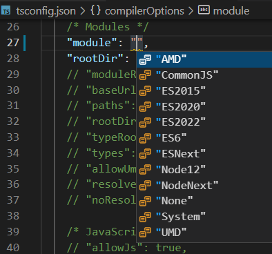

# Цель этого курса

Работа на TypeScript требует знаний. В первую очередь понимания взаимоотношений между значениями. Чтобы властвовать над всем разнообразием значений, которые получает ваша программа, мы поступим, как советует мудрость. Рассортируем их, сгруппируем по определенным признакам, другими словами разделим группы. В этом курсе мы займемся изучением этих групп - или **типов** значений.

TypeScript представляет из себя гораздо больше, чем статический анализатор типов. В жизни вам потребуется так же понимание системы модулей (как они создаются, и как загружаются). TypeScript может создавать модули и для браузера, и для node. Однако, мы не будем детально изучать особенности каждого формата в этом курсе.

множество вариантов модульных систем, для которых TypeScript может создавать код.

TypeScript может быть использован как полноценный объектно-ориентированный язык с полной и бескомпромиссной поддержкой всех принципов ООП. Мы лишь частично коснемся этих возможностей TypeScript. Нашей задачей является изучение вопросов связанных с типами классов. Методологию ООП мы затрагивать не будем.

TypeScript полезный инструмент в работе над новыми и при сопровождению существующих проектов, даже если они изначально работают в JavaScript. На сегодня TypeScript уже используется всеми популярными экосистемами, где раньше был только JavaScript. Среди них только назовем несколько [Angular](https://angular.io/guide/typescript-configuration), [React](https://create-react-app.dev/docs/adding-typescript/), [Node](https://nodejs.dev/learn/nodejs-with-typescript), [Next](https://nextjs.org/docs/basic-features/typescript), [Vue](https://v2.vuejs.org/v2/guide/typescript.html). Детально изучать особенности применения TypeScript в этих случаях мы не будем.

Мы, так же, не будем рассматривать вопросы сборки приложения и его развертывания. При использовании упаковщиков (webpack), скорее всего вы увидите больше знакомого чем нового. Хотя мы посмотрим на использование методов модульного тестирования и будем использовать некоторые из низ во время демонстраций. Каких либо предварительных знаний из этой области не потребуется.

Итак. Авторы ставят этим курсом задачу донести тонкости системы типов TypeScript, знания которых будут требоваться вам на каждой строчке исходного кода.
