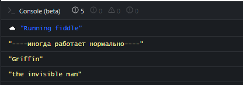
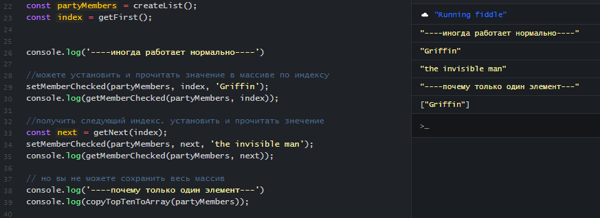

# Некоторые трудности обеспечения качества программы javascript

Посмотрите программу javascript ниже. Можете ли вы с уверенностью сказать, что она будет работать правильно?

```javascript
function process(text) {
  return text && text.replace(/б/g, "с")
}
let a = "боль";
process(a).toUpperCase();

```

Всегда ли она будет работать правильно? Насколько этот код устойчив к входящим значениям? А что если:

* `a=null` - Вы получите исключение `Uncaught TypeError: Cannot read properties of null (reading 'toUpperCase')`
* `a=0` - Вы получите исключение `Uncaught TypeError: process(...).toUpperCase is not a function`

Как выходить из положения?

Можно договориться, что `process` получает только параметр в виде строки.

Плюс, конечно, мы должны будем это задокументировать такое решение относительно типа аргумента. Но кто читает эту документацию! Она устаревает раньше чем выходит... 

Тогда мы можем заставить компьютер убедиться в соблюдении договоренности с помощью проверки.

```javascript
function process(text) {
  if(typeof text !== 'string'){
    throw new Error('Мы же договорились, параметр text должен быть строкой'):
  }
  return text && text.replace(/б/g, "с")
}
let a = "боль";
process(a).toUpperCase();

```

Правда, компьютер расскажет о нарушении договоренности между разработчиками не разработчикам, а пользователю. Нужно пользователю знать об этом во время исполнения программы? Да и разработчиков в это время поблизости не будет.

Теперь, если `process` это внутренняя функция модуля, мы могли бы гарантировать аргумент-строку. Тогда постоянная перепроверка типа аргумента в лучшем случае некрасива, а может и вызвать деградацию производительности.

Может понадеяться на авось и самоуспокоиться тем, что перед вызовом тип будет правильным? Тоже не самый лучший вариант, согласитесь.

Если вы хотите получить в руки инструмент решающий подобные вопросы элегантно и надежно, этот курс для вас. Этот инструмент - TypeScript. 

## Случай на работе

Во время участия в проекте вы получили библиотеку от коллеги.
Библиотека предоставляет сервис

* `createList` - создает новый список участников гала-концерта
* `getFirst` - позволяет получить первый начальный индекс
* `getNext`  - позволяет получить следующий индекс
* `setMemberChecked`  - позволяет установить значение указанному элементу списка, попутно выполняет проверки бизнес-правил
* `getMemberChecked`  - позволяет получить значение из списка
* `copyTopTenToArray` - позволяет скопировать первые 10 элементов в новый массив

*Реализация функций этой библиотеки вам будет интересна, и исходный код, хотя и в сокращенном для целей демонстрации виде, вы сможете найти ниже.*

Вы пользуетесь этими функциями и создаете программу, которая работает.

```javascript
const partyMembers = createList(); //создаете список
const index = getFirst(); // начинаете итерации
//можете установить и прочитать значение в массиве по индексу
setMemberChecked(partyMembers, index, 'Griffin');
console.log(getMemberChecked(partyMembers, index));

//получить следующий индекс. установить и прочитать значение
const next = getNext(index);
setMemberChecked(partyMembers, next, 'the invisible man');
console.log(getMemberChecked(partyMembers, next));
```

Вы запускаете программу и видите вывод



Однажды вам требуется получить специальный список якорных участников концерта, тех, на которых точно пойдут зрители. Это первая десятка чарта.

Вы думаете, а зачем мне делать цикл `getFirst`, `getNext...` если можно получить первую десятку `copyTopTenToArray`

Вы дополняете программу строкой

```javascript
console.log(copyTopTenToArray(partyMembers));
```

Однако результат работы показывает в массиве только один элемент.



Понятно, что человек *невидимка*, что *положение обязывает*, но...

Ясно, что библиотека содержит дефект. Ваш-то код - уж точно верный. Вы замечали, что ваш код всегда верный, а чужой код всегда "требует доработки"?

Вы сообщаете коллеге о проблеме, только он не согласен с вами. Он даже показывает вам исходник функции copyTopTenToArray

```javascript
const copyTopTenToArray = (buffer)=> buffer.slice(0,LIMIT);
```

Может быть значение константы LIMIT равно 1? Но нет! const LIMIT = 10;

Где же проблема?

Если интересно, попробуйте найти ее в коде. Вот исходник библиотеки

```javascript
const LIMIT = 10;
// несколько библиотечных функций для работы с массивами
const createList =()=>[];
const getFirst = ()=>[0];
const getNext = (current) => current+1;
const setMemberChecked = (buffer, index, value) =>{
  if(index<LIMIT){
    buffer[index] = value;
    return;
  }
  throw new Error('out of range')
}
const getMemberChecked = (buffer, index)=>{
  if(index<LIMIT){
    return buffer[index];
  }
  throw new Error('out of range')
};
const copyTopTenToArray = (buffer)=> buffer.slice(0,LIMIT);
```

Его же можете посмотреть в [jsfiddle](https://jsfiddle.net/Maxim_Wolf/8wu14tc2/latest)


При использовании TypeScript такой проблемы возникнуть не могло бы изначально. Если, для иллюстрации, вы [откроете ссылку](
https://www.typescriptlang.org/play?#code/MYewdgzgLgBAMgSQLIICowLwwIwAYDcAsAFAD0pMgvCCCsIIIIggXCCB8IINwggMiBMyCMIIBwgnz3jQEIg1QOIglQNIggURAYgERBAwiCV6gMRBugThAYgFhBmgeRAYgARBADCCch4mLRiAeEAO1a3QEwgBi9xKhIsYACcApgEMoXuABLaEwACgBKDAA+AG0AXSJiVxCAcy8oADFAjxCsCOiY3ASXcFT0gDkvAA9YPOAAVw9vMCgALjB6gFsAIy8PcMwomAamrxaAamxE5NgIdKQvHr6AYQALL2AAay8AE0wYAB50av8wHYgYerBNsBAAdzAo0O76gDNXvtbUeIAaGECztV2l1eh4-gA3HwAG3qXi+4Va4JAgT20QA3iQYP9XqEATtqgdEChUOEMcQsViXu8+jE8dU4vtITCvIkKTBvFBGmBWTAAL6YmBQVYee4wMBeO4wACiTRAHlCAHIQPVYCBXuyfGA0grwiR+UlSrA0lAFksPGsNttUYdjjUxudLtdbg8nlSPh4vr9-oCqsCzQjUOiBYEcXSqoTkGhSQKsRyuTA3TSw8VyXyBUKRZLxZKZSL5UqVTA1RqtV4dXrpobhiAAA4AT1QtdQY0bAEEmj46-sjjATvaLlcbvdHs83u7WjBvnFIkNEx4AHQQKGBYBeUK4H5EqOJEglNwwGs+DxQOum0EXLCeXz+ILQCKV-dh-bGrI5KD33fEPcQEBQrzzqEQBSRUAFowJA7hKEYQBmEA0Ax9CMIQDGoQQqEYPQrDYKDwJA8svzIUgLEYQA2EBQ6gYDkWhBAMKC7G4QRWBgbgYEAfhA9EYER6IMBiYEAdhBKAMERqEobhyLsSxrFsOxyJYxgmMoDRqHoWg5BIOYTUWUELS2XZQkPY9T00voID+MM-gVABxDwQ1eAEdQfH8-wAoDQmNM8VnWHSdj0o8T3cnJTJ9cJwh3AjZOYOROJ42hmGoDQ5EAORBAEkQNR5MU5T5woqiaMYOieOYtiOK4nj+NEYTRO-WBxRqZ8KhOXEgsSdT-O0q0fIM-yTLFE5zKFLxvXBYJAm6P8YE6TV7O-X9-0A4C3KM81PLa-S-IWrrqqgYLQvINCYDsUwaEsEiyLMRhJEMESeOk2hGKsGx7CmpzZtA8DZKEiw5BgQQWHYOTGA0SCYEAWRBYosYTBHAvDkmm5zgNAetGxrZswDbDs63a1azQgLaSCAA) то, TypeScript вам сразу подскажет, есть проблема с типами значений индекса. Это произойдет, даже если библиотеку создавали не вы.

## Некоторые выгоды от использования typescript

Вы можете использовать множество полезных свойств TypeScript в своей повседневной работе. Вот некоторые из них

* Улучшенная работа Intellisense
* Возможность накладывать правила на стиль написания кода с автоматической проверкой
* Проверка корректности использования значений в соответствии с типом данных
* Создание стимула к улучшению структурирования кода
* Выявление ошибок на этапе компиляции
* Улучшенное ООП

В следующих разделах мы вместе познакомимся со всеми этими особенностями.
