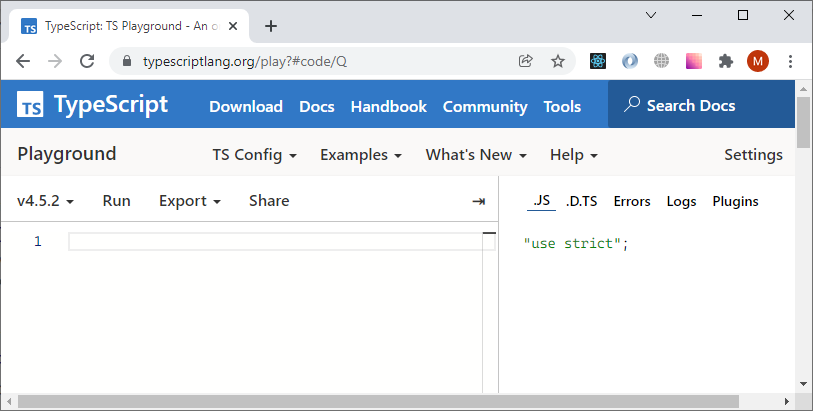

# Песочница для проверки TypeScript-идей

В статьях курса вы встретите ссылки на песочницу: она нужна для знакомства с возможностями языка и для экспериментов. Онлайн-редактор песочницы вы найдёте по адресу [https://www.typescriptlang.org/play](https://www.typescriptlang.org/play).

Цель песочницы — предоставить для работы с TypeScript-кодом безопасное окружение, которое не требует установки. Вы можете делиться с коллегами ссылками на модели и примеры, созданные в песочнице.

При необходимости редактор может импортировать описание типов из npm.



В левой части окна вы можете описывать программу на TypeScript. В правой — изучать результаты работы компилятора. Здесь также можно:  

* рассмотреть результат JavaScript;
* увидеть сообщения об ошибках;
* изучить определения типов, созданных компилятором;
* прочитать вывод на консоль;
* подключить дополнительные плагины.

Песочница предоставляет ряд инструментов и настроек, которые дополняют редактор. Вы можете изменять настройки и флаги компиляции во вкладке TS Config.  

Песочница задумана для исследования возможностей TypeScript — она не предназначена для запуска результатов компиляции. Тем не менее создатели предоставили кнопку Run. При нажатии на неё происходит следующее:  

* TypeScript компилируется в JavaScript;
* удаляются ссылки на reflect-matadata;
* JavaScript запускается в контексте сессии браузера;
* в правой части окна выводятся результаты вызова методов log, debug, warn error.

Для запуска можно использовать Ctrl+Enter или Cmd+Enter.

## Сообщения об ошибках

Перед погружением в основной материал курса исследуйте в песочнице приведённые ниже примеры. Попробуйте **пропустить** ошибку. Вы убедитесь, что даже в самых простых случаях вы получите хорошую защиту от опечаток и тем самым сэкономите время поиска ошибок.

Под надзором TypeScript эта программа компилируется успешно:

```tsx
function process(text:string) {
  return text.replace(/б/g, "с")
}
let a = "боль";
process(a).toUpperCase();
```

[Посмотреть в песочнице](https://www.typescriptlang.org/play?#code/GYVwdgxgLglg9mABABwE5wgUwM7YBRSYAeUAXNlKjGAOYCUiA3gFCKKqZQipKEkB0HZABsAhljwB6QIwgkmgBpEAIkCCIErrMAvs2GdEoxAF5l0wHwggbhBAMiBKA3MzQYc+UXX5Q4AVWTJMqAMKi2Jh4dDZAA).

А следующие две ещё в редакторе предупреждают разработчика об ошибках:

```tsx
function process(text:string) {
  return text.replace(/б/g, "с")
}
let a = null;
process(a).toUpperCase();
//      ^
//      Argument of type 'null' is not assignable to parameter of type 'string'.(2345)
```


[Посмотреть в песочнице](https://www.typescriptlang.org/play?#code/GYVwdgxgLglg9mABABwE5wgUwM7YBRSYAeUAXNlKjGAOYCUiA3gFCKKqZQipKEkB0HZABsAhljwB6QIwgkmgBpEAIkCCIErrMAvs2GdEoxAF5EYEMOEBuZmgw58ouvyhwAqsmSZUAYVHZMeOgsgA).

И здесь тоже:

```tsx
function process(text:string) {
  return text.replace(/б/g, "с")
}
let a = 0;
process(a).toUpperCase();
//      ^
//      Argument of type 'number' is not assignable to parameter of type 'string'.(2345)
```


[Посмотреть в песочнице](https://www.typescriptlang.org/play?#code/GYVwdgxgLglg9mABABwE5wgUwM7YBRSYAeUAXNlKjGAOYCUiA3gFCKKqZQipKEkB0HZABsAhljwB6QIwgkmgBpEAIkCCIErrMAvs2GdEoxAF5EABgDczNBhz5RdflDgBVZMkyoAwqOyY8dM0A).

Используйте ссылку и убедитесь сами в песочнице  TypeScript .
