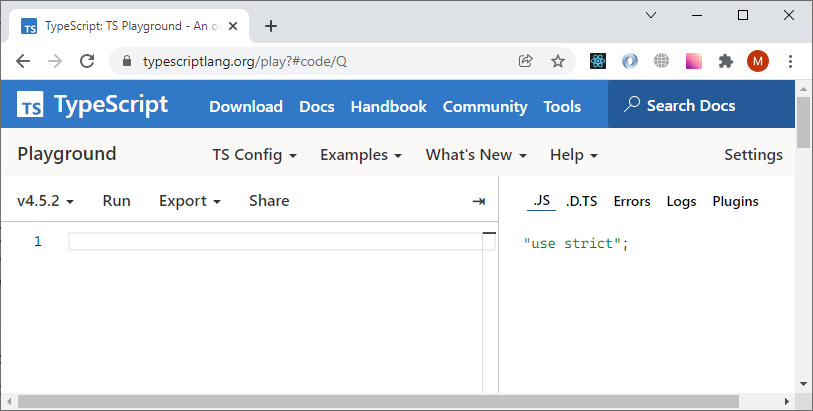
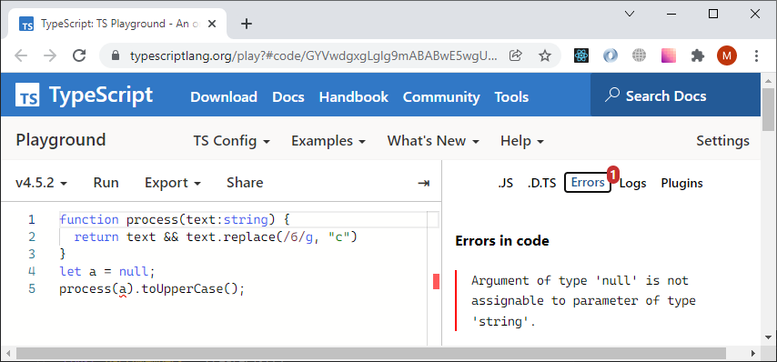
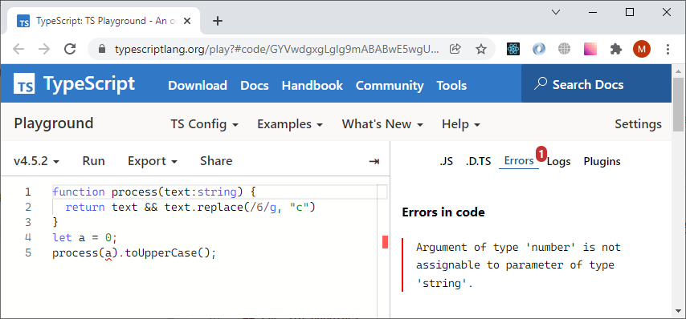

# Пишем и проверяем, пишем и проверяем

 TypeScript  предоставляет разработчику инструмент для создания условий исключающих случайный вызов функций (типа `process`) с неверным количеством и типом параметров. Это достигается при помощи дополнения текста программы javascript описанием требований к типам значений и использованием специального компилятора tsc.

Компилятор читает и проверяет указанные требования и если все правила соблюдаются **удаляет** из программы аннотацию типов и оформляет текст в виде обычного javascript. В зависимости от настроек результат может соответствовать и самым свежим стандартам javascript и более древним. Это дело техники.

## Замечания о песочнице

В ходе курса мы будем давать ссылки на песочницу. Создатели TypeScript предоставляют инструмент для знакомства возможностями языка. Этот онлайн-редактор вы можете найти по адресу https://www.typescriptlang.org/play. 

Цель песочницы - предоставить безопасное окружение, которое не требует установки, где вы можете работать с TypeScript кодом. Вы можете делиться ссылками на модели и примеры, созданные в песочнице, с коллегами. 

При необходимости редактор может импортировать описание типов из npm. 



В левой части окна вы можете описывать программу на TypeScript, а в левой изучать результаты работы компилятора. В частности, вы можете в правой части  

* рассмотреть результат JavaScript  
* Изучить сообщения об ошибках (если они есть) 
* Изучить определения типов, созданных компилятором 
* Прочитать вывод на консоль 
* Подключить дополнительные плагины 

Песочница предоставляет ряд инструментов и настроек, которые дополняют редактор. Вы можете изменять настройки и флаги компиляции на закладке TS Config.  

Песочница предназначена для исследования возможностей TypeScript, другими словами, не предназначена для запуска результатов компиляции... Создатели, все же предоставили кнопку Run. Это минимализм. При нажатии на эту кнопку происходит  

* Компиляция TypeScript в JavaScript 
* Удаляются ссылки на “reflect-matadata” 
* JavaScript запускается в контексте сессии браузера 
* Результаты вызова методов log, debug, warn error выводятся в правой части окна 

Для запуска вы можете использовать Ctrl+Enter (Cmd+Enter) 

Теперь рассмотрим программу из предыдущего раздела, но уже в контексте TypeScript и с аннотацией типов

## В борьбе за качество кода

Под надзором TypeScript следующая программа компилируется успешно,

```tsx
function process(text:string) {
  return text && text.replace(/б/g, "с")
}
let a = "боль";
process(a).toUpperCase();
```

[Playground Link](https://www.typescriptlang.org/play?#code/GYVwdgxgLglg9mABABwE5wgUwM7YBRSYAeUAXNlKjGAOYCUiA3gFCKKqZQipKEmIAyAYj5QAdB2QAbAIZY8AekCMIApoAaRACJAgiCa6zAL7MpnRDMQBeLUsB8IIG4QQDIgmgNzM0GHPhl0xUOAFVkZExUAGEZbEw8OmcgA)

а следующие две предупреждают разработчика еще в редакторе, что договоренности не соблюдаются.

```tsx
function process(text:string) {
  return text && text.replace(/б/g, "с")
}
let a = null;
process(a).toUpperCase();
//      ^
//      Argument of type 'null' is not assignable to parameter of type 'string'.(2345)
```



[Playground Link](https://www.typescriptlang.org/play?#code/GYVwdgxgLglg9mABABwE5wgUwM7YBRSYAeUAXNlKjGAOYCUiA3gFCKKqZQipKEmIAyAYj5QAdB2QAbAIZY8AekCMIApoAaRACJAgiCa6zAL7MpnRDMQBeRGBBSpAbmZoMOfDLpiocAKrJkmVABhGWxMPDp7IA)


И здесь тоже предупреждает

```tsx
function process(text:string) {
  return text && text.replace(/б/g, "с")
}
let a = 0;
process(a).toUpperCase();
//      ^
//      Argument of type 'number' is not assignable to parameter of type 'string'.(2345)
```



[Playground Link](https://www.typescriptlang.org/play?#code/GYVwdgxgLglg9mABABwE5wgUwM7YBRSYAeUAXNlKjGAOYCUiA3gFCKKqZQipKEmIAyAYj5QAdB2QAbAIZY8AekCMIApoAaRACJAgiCa6zAL7MpnRDMQBeRAAYA3MzQYc+GXTFQ4AVWTJMqAMIy2Jh4dLZAA)

Используйте ссылку и убедитесь сами в песочнице  TypeScript .

## Где это работает

Вы можете запускать TypeScript в командной строке терминала. Этот инструмент работает во многих популярных **редакторах**. Обратите еще раз внимание на то, что  TypeScript -история - это про написание, редактирование и исправление программы, а не про ее работу в javascript-движке. Мы займемся установкой компилятора в следующем разделе.
