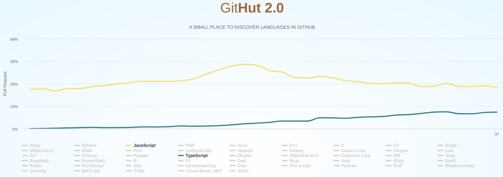

# Добро пожаловать в мир typescript

Популярность использования typescript в последние несколько лет заметно растет. На [графике](https://madnight.github.io/githut/#/pull_requests/2021/2) количества pull-request-ов это хорошо видно.



Разработчики веб приложений много используют javascript в своей работе, так  исторически сложилось. Сам javascript постоянно развивается и улучшается, однако ему остаются присущи определенные проблемы.

## Проверка во время runtime

Посмотрите программу javascript ниже. Можете ли вы сказать, что она будет работать правильно?

```javascript
function process(text) {
  return text && text.replace(/б/g, "с")
}
let a = "боль";
process(a).toUpperCase();

```

Всегда ли она будет работать правильно? Насколько этот код устойчив к входящим значениям? А что если:

* `a=null` - Uncaught TypeError: Cannot read properties of null (reading 'toUpperCase')
* `a=0` - Uncaught TypeError: process(...).toUpperCase is not a function

Как выходить из положения?

Можно договориться, что `process` получает только параметр в виде строки и убедиться в соблюдении договоренности с помощью проверки.

```javascript
function process(text) {
  if(typeof text !== string){
    throw new Error('Мы же договорились, параметр text должен быть строкой'):
  }
  return text && text.replace(/б/g, "с")
}
let a = "боль";
process(a).toUpperCase();

```

Предположим, что `process` это внутренняя функция модуля, и мы могли бы гарантировать аргумент строку, неужели нам так и придется выполнять проверку, которая всегда будет подтверждать правильность типа параметра? Может понадеяться на авось и самоуспокоиться тем, что перед вызовом тип будет правильным? Не самый лучший вариант.

Если вы хотите получить в руки инструмент решающий подобные вопросы элегантно и надежно, этот курс для вас. Этот инструмент - typescript.

## Проверка во время compose-time

Typescript предоставляет разработчику инструмент для создания условий исключающих случайный вызов функций (типа `process`) с неверным количеством и типом параметров. Это достигается при помощи дополнения текста программы javascript описанием требований к типам значений и использованием специального компилятора tsc.

Компилятор читает и проверяет указанные требования и если все правила соблюдаются **удаляет** из программы аннотацию типов и оформляет текст в виде обычного javascript. В зависимости от настроек результат может соответствовать и самым свежим стандартам javascript и более древним. Это дело техники.

Под надзором typescript следующая программа компилируется успешно,

```tsx
function process(text:string) {
  return text && text.replace(/б/g, "с")
}
let a = "боль";
process(a).toUpperCase();
```

[Playground Link](https://www.typescriptlang.org/play?#code/GYVwdgxgLglg9mABABwE5wgUwM7YBRSYAeUAXNlKjGAOYCUiA3gFCKKqZQipKEmIAyAYj5QAdB2QAbAIZY8AekCMIApoAaRACJAgiCa6zAL7MpnRDMQBeLUsB8IIG4QQDIgmgNzM0GHPhl0xUOAFVkZExUAGEZbEw8OmcgA)

а следующие две предупреждают разработчика еще в редакторе, что договоренности не соблюдаются.

```tsx
function process(text:string) {
  return text && text.replace(/б/g, "с")
}
let a = null;
process(a).toUpperCase();
//      ^
//      Argument of type 'null' is not assignable to parameter of type 'string'.(2345)
```

[Playground Link](https://www.typescriptlang.org/play?#code/GYVwdgxgLglg9mABABwE5wgUwM7YBRSYAeUAXNlKjGAOYCUiA3gFCKKqZQipKEmIAyAYj5QAdB2QAbAIZY8AekCMIApoAaRACJAgiCa6zAL7MpnRDMQBeRGBBSpAbmZoMOfDLpiocAKrJkmVABhGWxMPDp7IA)

```tsx
function process(text:string) {
  return text && text.replace(/б/g, "с")
}
let a = 0;
process(a).toUpperCase();
//      ^
//      Argument of type 'number' is not assignable to parameter of type 'string'.(2345)
```

[Playground Link](https://www.typescriptlang.org/play?#code/GYVwdgxgLglg9mABABwE5wgUwM7YBRSYAeUAXNlKjGAOYCUiA3gFCKKqZQipKEmIAyAYj5QAdB2QAbAIZY8AekCMIApoAaRACJAgiCa6zAL7MpnRDMQBeRAAYA3MzQYc+GXTFQ4AVWTJMqAMIy2Jh4dLZAA)

Используйте ссылку и убедитесь сами в песочнице typescript.

## Где это работает

Вы можете запускать typescript в командной строке терминала. Этот инструмент работает во многих популярных редакторах. Мы займемся его установкой в следующем разделе.
