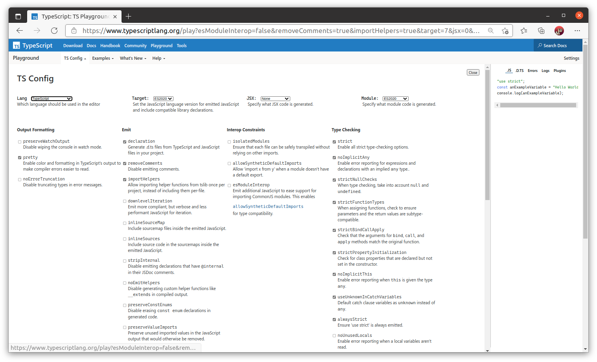
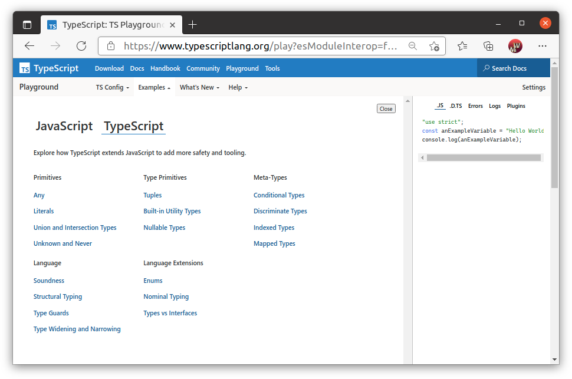
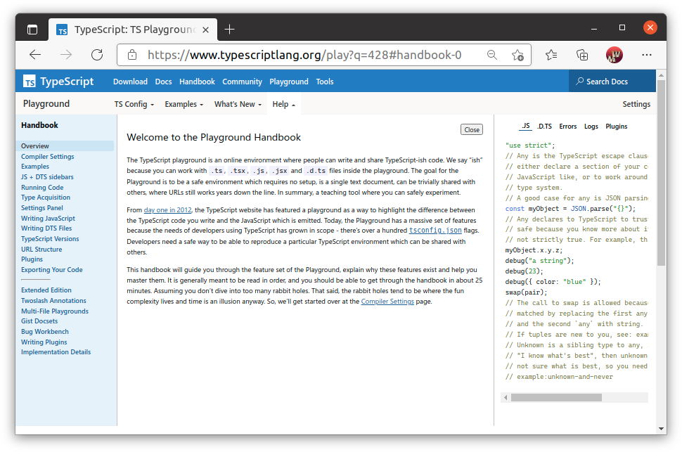
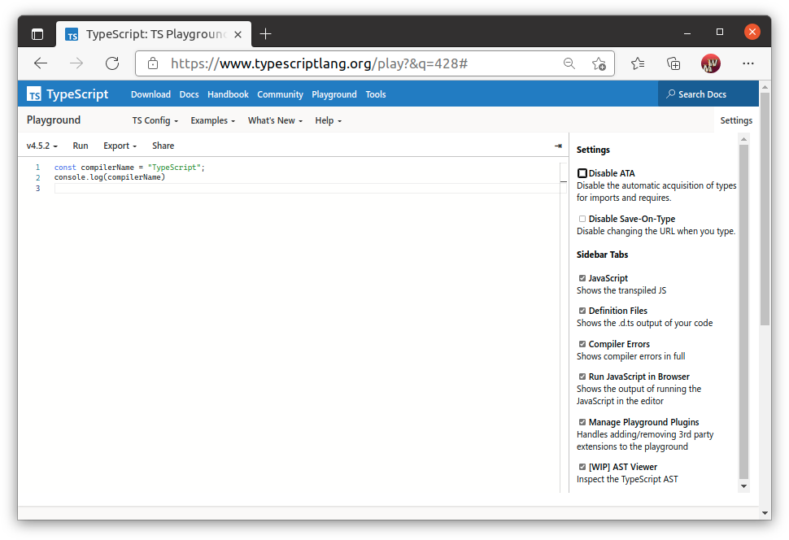

# Песочница для typescript
## Официальная песочница typescript
Вы можете найти интерактивый сайт для изучения TypeScript по адресу
https://www.typescriptlang.org/play

Интерфейс песочницы разделен на две логические части. Слева вы пишете на typescipt, а справа отображается результат компиляции из TypeScript в javascript.

 TypeScript  развивается очень стремительно. Новые версии выходят часто, в них добавляются полезные функции с которыми полезно знакомится. Песочница предоставляет в левом верхнем углу выбор версии компилятора. Как раз для такого знакомства.

Кстати, мы употребляем термин комплятор как синоним транслятор. Действительно  TypeScript  (tsc) переводит написанный вами текст в искодный код javascript, для последующей интерпертации движком браузера или nodejs.

## Интерфейс песочницы TypeScript

Разработчики TypeScript предоставляют интерактивное окружение, где вы можете не только написать код, но и поэкспериментировать с различными настройками компилятора. На закладке `TS Config` вы найдете все флаги компилятора.

Вы можете менять настройки и сразу видеть в правом боковом окошке как меняется результат компиляции. Мы рекомендуем вам изучить влияние флагов. Для начала посмотрите как будет меняться результат при изменении флага `removeComments`. Затем изучите и другие флаги.

Прямо здесь, в песочнице, вы можете ознакомится с примерами, демонстрирующие особенности TypeScript. Авторы предлагают полторы дюжины примеров на разные темы

Код в примерах аккуратно прокомментирован и обращает ваше внимание на все основные элементы выбранной темы.

На закладке `Help` вы можете ознакомится с подробным описанием всех возможностей песочницы.

В правой части, меню `Settings`, позволяет вам выбрать какие закладки которые интересны вам в данный момент. Среди предоставляемого сервиса вы найдете результат компиляции, файл с определениями, отчет об ошибках и вывод запуска javascript. Вы можете даже найти дерево абстрактного синтаксиса TypeScript.

## Другие способы работы с TypeScript
В свободном интернете можно найти несколько площадок, позволяющих создавать и запускать код на typescript.

Не претендуя на исчерпывающий список обозначим пару вариантов.

* [jsfiddle](https://jsfiddle.net/) позволяет создать и запустить скрипт. Редактор этого сайта не будет вам подсказывать что-то о типах, но поймет синтаксис, оттранслиует его и запустит.
* [codesandbox](https://codesandbox.io/) позволяет готовить и запускать многофайловые пакеты npm. 

Для прохождения курса вы можете использовать codesandbox.
