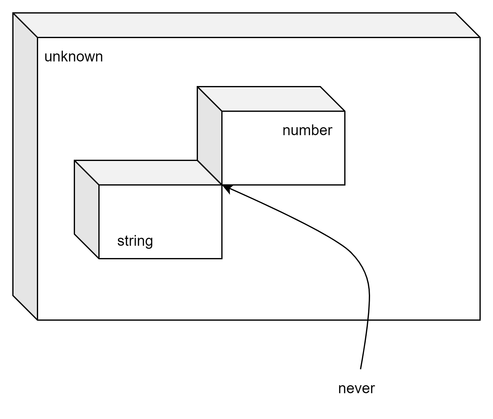

# Вертикаль во вселенной типов, верхний и нижний типы

## Теория типов

Для наших целей тип это вывеска на коробке. На вывеске написано название типа, а внутри коробки лежат элемент - все возможные значения типа

* В коробке с названием *number* лежат значения, которые определены стандартом IEEE-754 (кроме Infinity, NaN)
* В коробке с названием *string* лежат строки. Их там бесконечно много.
* В коробке boolean - два элемента.
* и т.д.

## Операции с типами

Возьмем коробку побольше и объединим в ней содержимое наших *string* и *number*. Взболтаем и перемешаем.

Элемент, который мы можем вытащить из этой большой коробки может быть числом или строкой.

Коробка стала "шире", но чтобы поработать с каким либо значением из этой коробки сначала приходится уточнять что нам попалось на этот раз - число или строка.

**Внимание!** Чтобы описать объединение нескольких типов,  TypeScript  применяет оператор `|`. Синтаксис: `string | number`

Можно представить другую ситуацию. Нам нужны такие значения, которые одновременно находятся в двух или нескольких коробках. Множество таких значений пересечение исходных множеств доступных значений. Подумайте, результатом после вызова функции encounterFlyingDutchman будут не все жители Нидерландов, а только летучие голландцы.

```typescript
type Flying = {
    fly():void,
};
type Fish = {
  swim():void,
};
type Saucer = {
    holdJam():void;
}
type Dutchman = {
    moveToAmsterdam():void;
}

declare const flyingFish: Flying & Fish;
declare const flyingSaucer: Flying & Saucer;
declare const flyingDutchman: Flying & Dutchman;

getFlyingFish.fly();
detectFlyingSaucer.fly();
encounterFlyingDutchman.moveToAmsterdam();
```

**Внимание** Если мы хотим потребовать от TypeScript такой новый тип, значения которого одновременно являются значениями нескольких других, мы используем синтаксис `string & number`.

* читайте `type n = a | b` как: новый тип, значения которого являются либо значениями типа `a` либо значениями типа `b`
* читайте `type n = a & b` как: новый тип `n` такой, что любое значение этого типа является одновременно значение и типа `a` и типа `b`.

Как бы вы прочитали?

```typescript
type n = (string | number) & string;
```

## Порядок во вселенной типов

Мы уже говорили, что компилятор может сравнивать типы. Для двух типов может случиться так, что одни расширяет другой. Выше мы составляли тип `string | number`, он шире, чем отдельно `string` или отдельно `number`. Если продолжать наводить порядок среди всего разнообразия типов, найдется ли тип, шире которого ничего нет? А как на счет самого узкого типа - уже которого не бывает? Можем ли мы построить что-то вроде оси координат?

```text
самый узкий < пошире < ... < еще пошире < ... < самый широкий
```

Оказывается что-то подобное можно построить.

## Единичные элементы системы типов

Помните, при сложении чисел есть такое специальное число 0. Его можно добавлять к любому другому числу, но "ничего не поменяется". При умножении есть другое специальное число 1. Эти числа еще называют - единичными элементами относительно операции сложения и операции умножения. У TypeScript есть две специальные коробки - их названия - unknown и  never.

тип unknown работает единичным элементом для операции пересечения

```typescript
  T & unknown => T
```

Коробка с именем unknown самая широкая, но зато на ней пустой список операций. Ничего мы не можем сделать с этим типом. Ну разве что `typeof` выяснить.

Тип never работает единичным элементом для операции объединения

```typescript
  T | never => T
```

Коробка с этим типом самая узкая - в ней нет никаких элементов. Немудрено, что с любым элементом (из нуля) элементов можно совершать любые операции. Такая уж математика.



В следующем разделе мы рассмотрим специализацию примитивных типов. Да, оказывается и `boolean` можно специализировать, коробку с boolean сузить.
