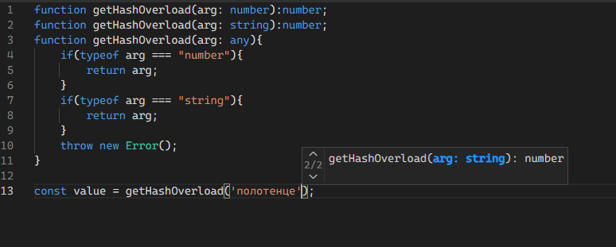

# Перегрузка функций

## Список параметров

Любой вариант описания типа функции позволяет указать список параметров, которые нужны для её работы. Необходимо указывать имя формального параметра и его тип.

```typescript
type PrimeDetector = (intToTest:number)=>boolean;
type GCDService = (a:number, b:number)=>number;
```

Имя формального параметра в описании типа может не совпадать с именем параметра при описании функции:

```typescript
const isPrime: PrimeDetector = function (value) {
    switch (value) {
        case 2:
        case 3:
        case 5:
        case 7:
            return true;
    }
    if(value<10){
      return false;
    }
    throw new Error('a very difficult problem');
}
```

В приведённом примере функция `isPrime` использует параметр `value`, имя которого отличается от имени `intToTest` в описании типа. Программа при этом компилируется без ошибок.

## Функции, обрабатывающие данные разных типов

В JavaScript функция может быть готова к работе с аргументом нескольких типов. Вы можете сообщить компилятору, что функции определённого типа готовы к такому повороту событий, используя пересечение типов.

> Более подробно операции объединения и пересечения типов мы обсуждали во втором модуле.

Следующее определение информирует компилятор о том, что функция работает и с числами, и со строками:

```typescript
function getHash(arg: string|number):number{
    if(typeof arg === "number"){
        return arg;
    }
    return arg.length;
}
```

Вы можете использовать перегрузку функций. В этом случае вы записываете одно за другим все варианты возможных аргументов и тут же, после всех деклараций, записываете реализацию. Обратите внимание, что тип реализации доступен только для компилятора, а тип аргументов реализации должен объединять все типы в перегруженных декларациях.

```typescript
function getHashOverload(arg: number):number;
function getHashOverload(arg: string):number;
function getHashOverload(arg: unknown){
    if(typeof arg === "number"){
        return arg;
    }
    if(typeof arg === "string"){
        return arg.length;
    }
    throw new Error();
}

const value = getHashOverload('полотенце');
```

[Посмотреть в песочнице](https://www.typescriptlang.org/play?ssl=13&ssc=44&pln=1&pc=1#code/GYVwdgxgLglg9mABAcwKZQBIEMDOALAeQDdUAnAGziwBMAKLU5ALkTBAFsAjMgSiba5kA3AChQkWAhTps+YmUo16jFjiikYYZHwHdSo8dHhI0mXIRIUqdBs0TgA1mDgB3MDwDeIxD8QxgtFAAngAOqHDAiLaIALxxiABEumQJnt6+GaToIKRItqIZAL7pPv6BoeGR0XExiWoaWqleGZnZuVGMAHTkqFpQeAW+xRn9pK6sqC6IAKKkY6S0PKLFIhAIaohEWOQgqLHSZnKWinQA5ID8IIB8IIDcIJeAQiCArCCAvCCAYiAPp0siQA).

При использовании такого определения функции TypeScript предлагает на выбор два варианта вызова.



Этот вариант декларации универсальных функций позволяет потребовать от пользователя функции использования при вызове значений предусмотренного типа. Однако для реализации такой декларации автору функции приходится самостоятельно проводить дополнительную проверку фактического типа полученного значения аргумента.

Использование обобщённого программирования позволяет написать программу третьим способом.

```ts
function getHashGeneric<T extends string|number>(arg:T):number{
    if(typeof arg === 'number'){
        return arg;
    }
    if(typeof arg === 'string'){
        return arg.length;
    }
    throw new Error('invalid argument');
}

const hash1 = getHashGeneric(42);
const hash2 = getHashGeneric('towel')
```

[Посмотреть в песочнице](https://www.typescriptlang.org/play?ssl=12&ssc=38&pln=1&pc=1#code/GYVwdgxgLglg9mABAcwKZQBIEMDOALAcVTFQCcYIAeAFUVQA8piATHRHKcsZAHzBAC2AIzIA+ABRZSyAFzUAlDP7CyAbwBQiLYhjBxUAJ4AHVHGCIpyRAF5biAOTKRpe-I3aPiUuhCkklgG5NbQBfYK1dfWNTc0sbO3sOLmRXd08tbyhff2kAOgAbYmQoPCCPMI8S0jgAd0QSOoBRUmrScXsYMAA3LHyYZgtpQWIoVyCw9QgEDkQ8XDwARhsUdGx8IhJyCHEAFgAmeSCpsBm5-D3ltEx5jbIKdqha1HzXIA).

Откройте предыдущий пример в песочнице и посмотрите, какие типы аргументов ожидает функция `getHashGeneric`.

```typescript
const value = 42 as string|number;
console.log(getHash(value)); //Компилируется без ошибок.
console.log(getHashOverload(value)); //Ошибка 2769.
```

[Изучите поведение](https://www.typescriptlang.org/play?target=7#code/GYVwdgxgLglg9mABAcwKZQBIEMDOALACiwCdkAuRHKYmMZAHzBAFsAjVYgSjKbY4G8AUIhGIYwAlACeAB1RxgiEskQBedYgBEvdsU2choo4mLoQxJMoDcw0QF9bI01HOXSAOgA2qOlDw2HQVBIWAQUdGx8AHkANw5POCwAEyJSCh0ObgziG2DoeCQ0TFw8WPjElOUKKho6LJZdXPB8sKLI0rjiBOTU8iUwKQNHMQlpOQUlUjUNbQaOfUNjJzMLSeQbIwcjcUlZeUVladUtGtpkBeGjZ1c1jfthv2I4AHdEMFRXgFFiJ+ICTgCgkESVQEE8JFQiAgCCoIhiWE8IFQ1WoZ0YcxyQOhYBwcG8XjgyAIbRKBHhiNQnABiAA9DTAFwggD4QQA8IIB+EEAHCCAbhB2YABEEAwiCAVhBAEIggEEQQDyIIhAIwgAsA7CCIRmACRB2ZLGfTBNjcfiEkSSdFOt0UuSkVSrLSaYrlfTAAwgiAATAB2ABsAE4gA) этого кода в песочнице.

```text
No overload matches this call.
  Overload 1 of 2, '(arg: number): number', gave the following error.
    Argument of type 'string | number' is not assignable to parameter of type 'number'.
      Type 'string' is not assignable to type 'number'.
  Overload 2 of 2, '(arg: string): number', gave the following error.
    Argument of type 'string | number' is not assignable to parameter of type 'string'.
      Type 'number' is not assignable to type 'string'.
```

## Обобщённое программирование функций

Использование обобщённого параметра при определении функции позволяет создавать реализацию алгоритмов в общем виде.

В приведённом примере разработчик выражает намерение работать с массивами значений. С помощью использования обобщённого типа аргумента `<T>` разработчик объясняет компилятору: *какие типы значений будут у элементов в массиве во время исполнения, значение такого типа и вернёт функция*.

```typescript
// Алгоритму неважно, какого типа элементы
// содержатся в массиве, но важно, что их 
// там как минимум один.
function extractFirstElement<T>(array:T[]):T{
    if(array.length>0){
        return array[0];
    }
    throw new RangeError(`Попытка выхода за пределы массива`);
}

const num = extractFirstElement([1,2,3]);
const str = extractFirstElement(["a","b","c"]);
```

Переменная `num` получает значение `1` типа `number`, а переменная `str` — значение `"a"` типа string. Но важно даже не это, а то, что компилятор об этом догадывается сам.

## Объявление типа перегруженной функции

Чтобы объявить тип перегруженной функции, но не указывать реализацию, как в примере `getHashOverload`, используйте сигнатуру вызова в интерфейсе:

```ts
interface HashComputer {
    (arg: number): number;
    (arg: string): number;
}

//Позднее используем этот интерфейс для создания реализации.
const getHashOverload: HashComputer = (arg: unknown): number=>{
    if (typeof arg === 'number') {
        return arg;
    }
    if (typeof arg === 'string') {
        return arg.length;
    }
    throw new Error('invalid argument');
};
```

После демонстрации мы рассмотрим, как классы в TypeScript населяют сразу несколько Вселенных: и Вселенную типов, и Вселенную значений.
