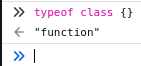

# Классы и их интерфейсы

В javascript ключевое слово `class` позволяет создать описание класса. Это описание можно использовать с ключевым словом `new` и создавать экземпляры класса. Если во время выполнения javascript спросить мнение оператора `typeof`, то вы узнаете, что класс это функция. В консоли браузера вы это можете увидеть.



## Классы TypeScript

Классы в TypeScript обладают гораздо более полным набором качеств, необходимых для построения системы в рамках философии ООП.

TypeScript дополняет описание класса возможностями, отсутствующими в javascript.

* модификатор `private` указывает компилятору на необходимость контролировать доступ к значению. (на этапе компиляции) только для членов текущего класса
* модификатор `protected` заставляет компилятор разрешать доступ к значениям поля только для текущего класса и его наследников.
* `public` (по умолчанию) это поля как и в javascript

Дополнительно, компилятор контролирует корректное использование абстрактных классов и методов, а так же модификатора readonly.

```ts
// компилятор не позволит создать 
// экземпляр абстрактного класса
abstract class Base {
    private readonly v: number;
    constructor(v: number) {
        //new.target всегда не Base
        this.v = v;
    }

    // создавать заглушку реализацию не требуется
    protected abstract getFactor(): number;

    public computeValue() {
        return this.v * this.getFactor();
    }
}

class Double extends Base {
    // компилятор потребует реализацию абстрактного метода
    protected getFactor(): number {
        return 2;
    }
}
```

Изучите [код](https://www.typescriptlang.org/play?#code/PTAEi4QQ+EEHhBH4QQOEENwgh5EEEIglACIKQvCCFYQUskg7CCBMIJIvKqIIIgxgLCCAMIKoDIgoAUCKILIg4RucKLA0CMINVQYG4VNkiBmEEgREDatQZsAhgCMAzgBcATuoDGu0EYA267dtAAhKwFNQAbzah3oAA76AlgDd1XSd9B3UAEwB7ADtzAE9QPwAuUCiAVwBbTQd9AG43DyNovX1Ukwj9AAoklIys-QBKF3yPDxAohwB3ADpddX0AcwdTEmpcWUYcfHttB2aW0F0ACx9tLr9QAF4EvJaAXzY5zloiRhImViIGWURAYRBACRBwG9AMXAYKS8AxEHhAORBJ0HFcMIbrhUNRkHNvBEgiYHGFQFpisZTINdAAxJHlCr1ZJpTLZPIQ1Kacw+IxmCLpTypIIANXU5lSDixTXmHhCulS+iiC2Wq3WACoeSsuij0WVKvUdh59vs2BYrDYACIRInmJwOAAeQSiYRs0ycrhanCgcCQaEwBEgAKBIOer3eDC+vxEYgkUhk8lA0BBkEYEP0UIcMLhooxEpxtWyLNZoHZnO5ACYpe4ZQcgA) в песочнице

Классы в TypeScript логически находятся в двух контекстах:

* в области значений это *функции снабженные модификатором `new`*
* в области типов это *описание свойств и методов*, участвующее в статическом анализе программы.

## Класс реализует интерфейс

В TypeScript класс может реализовывать один или множество интерфейсов. Таким образом достигается полиморфизм

```typescript
// Для правильной сериализации приватного
// состояния класс может реализовать интерфейс
interface Serializable<T> {
    toJSON(key: string): T;
}

class Model implements Serializable<{ id: number, name: string }>{
    private readonly id: number = 0;
    private readonly name: string = '';

    constructor(id: number, name: string) {
        this.id = id;
        this.name = name;
    }

    // использование метода интерфейса
    // позволяет JSON.stringify узнать
    // внутреннюю кухню объекта
    toJSON(): { id: number; name: string; } {
        return { id: this.id, name: this.name };
    }

    public get title() {
        return `${this.id} - ${this.name}`;
    }
}

const stream = JSON.stringify(new Model(42,'towel'));
// проверьте вывов в консоли песочницы
console.log(stream);
```

[Playground Link](https://www.typescriptlang.org/play?ssl=23&ssc=21&pln=1&pc=1#code/JYOwLgpgTgZghgYwgAgMrWHANsAXnAIywgB4AVAPmQG8AoZB5MAewClUB5AOQAoBrCAE8AXMgDOYKKADmASlFkA3LQC+tWgixwxY5AFlmAEwhZkwALYAHYuYjhd6KdjyFiJamcOiQAV3MFoABpkEDhbUQkpEGlkFQo6RmRLKQA3OEhkKAg4Q2YQLEFPbz8AqGQAXmQABmVE5OA0jKycvIKQsIgIyRkK5AByPuV6RgQ8yJ8EFigeYC8QkqD28PFu6NkaYcSGMAALYDEAOlne2dqt7b3D0Nte64gzhjVElnZuHnkaIvn-aEUlzpWUWkfxUG3ODCyYB8UBAn1mol2+yOhmCdwRlwOd1iD1i6jqPiIwAQyGkEDATGAYGI7zB4Mh0NhAAMACTURGHWaggC0yFZ7MxHRUjJxajUGjG5Mi2XMvVeXAOkRkwBggh4IAgAHd9EYTDwACwAJkCfRYGpMfVksmUoxAYmYxAOWGY0h4UrCVqAA)

## Класс - в качестве интерфейса
