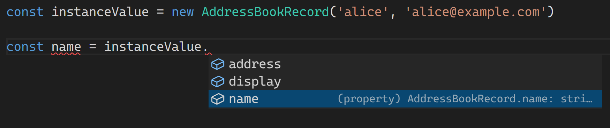

# Классы и их интерфейсы

В JavaScript ключевое слово `class` позволяет создать описание класса. Это описание можно использовать с ключевым словом `new` и создавать экземпляры класса. Если при выполнении JS спросить мнение оператора `typeof`, то вы узнаете, что класс — это функция. В консоли браузера можно увидеть:


## Классы TypeScript

Классы в TypeScript обладают гораздо более полным набором качеств, необходимых для построения системы в рамках философии ООП.

TypeScript дополняет описание класса возможностями, отсутствующими в JS:

- модификатор `private` указывает компилятору на необходимость контролировать доступ к значению (на этапе компиляции) только для членов текущего класса.
- модификатор `protected` заставляет компилятор разрешать доступ к значениям поля только для текущего класса и его наследников.
- `public` (по умолчанию) — это поля, как и в JavaScript.

Дополнительно компилятор контролирует корректное использование абстрактных классов и методов, а также модификатора readonly.

```ts
// Компилятор не позволит создать 
// экземпляр абстрактного класса.
abstract class Base {
    private readonly v: number;
    constructor(v: number) {
        //new.target всегда не Base.
        this.v = v;
    }

    // Создавать заглушку не требуется.
    protected abstract getFactor(): number;

    public computeValue() {
        return this.v * this.getFactor();
    }
}

class Double extends Base {
    // Компилятор потребует реализацию абстрактного метода.
    protected getFactor(): number {
        return 2;
    }
}
```

Изучите [код](https://www.typescriptlang.org/play?#code/PTAEi4QQ+EEHhBH4QQOEENwgh5EEEIglACIKQvCCFYQUskg7CCBMIJIvKqIIIgxgLCCAMIKoDIgoAUCKILIg4RucKLA0CMINVQYG4VNkiBmEEgREDatQZsAhgCMAzgBcATuoDGu0EYA267dtAAhKwFNQAbzah3oAA76AlgDd1XSd9B3UAEwB7ADtzAE9QPwAuUCiAVwBbTQd9AG43DyNovX1Ukwj9AAoklIys-QBKF3yPDxAohwB3ADpddX0AcwdTEmpcWUYcfHttB2aW0F0ACx9tLr9QAF4EvJaAXzY5zloiRhImViIGWURAYRBACRBwG9AMXAYKS8AxEHhAORBJ0HFcMIbrhUNRkHNvBEgiYHGFQFpisZTINdAAxJHlCr1ZJpTLZPIQ1Kacw+IxmCLpTypIIANXU5lSDixTXmHhCulS+iiC2Wq3WACoeSsuij0WVKvUdh59vs2BYrDYACIRInmJwOAAeQSiYRs0ycrhanCgcCQaEwBEgAKBIOer3eDC+vxEYgkUhk8lA0BBkEYEP0UIcMLhooxEpxtWyLNZoHZnO5ACYpe4ZQcgA) в песочнице.

Классы в TypeScript логически находятся в двух контекстах:

* в области значений это *функции, снабжённые модификатором `new`*
* в области типов это *описание свойств и методов*, участвующее в статическом анализе программы.

## Класс реализует интерфейс

В TypeScript класс может реализовывать один или множество интерфейсов. Так достигается полиморфизм.

```typescript
// Для правильной сериализации приватного
// состояния класс может реализовать интерфейс.
interface Serializable<T> {
    toJSON(key: string): T;
}

class Model implements Serializable<{ id: number, name: string }>{
    private readonly id: number = 0;
    private readonly name: string = '';

    constructor(id: number, name: string) {
        this.id = id;
        this.name = name;
    }

    // Использование метода интерфейса
    // позволяет JSON.stringify узнать
    // внутреннюю кухню объекта.
    toJSON(): { id: number; name: string; } {
        return { id: this.id, name: this.name };
    }

    public get title() {
        return `${this.id} - ${this.name}`;
    }
}

const stream = JSON.stringify(new Model(42,'towel'));
// Проверьте вывов в консоли песочницы.
console.log(stream);
```

[Посмотреть в песочнице](https://www.typescriptlang.org/play?ssl=23&ssc=21&pln=1&pc=1#code/JYOwLgpgTgZghgYwgAgMrWHANsAXnAIywgB4AVAPmQG8AoZB5MAewClUB5AOQAoBrCAE8AXMgDOYKKADmASlFkA3LQC+tWgixwxY5AFlmAEwhZkwALYAHYuYjhd6KdjyFiJamcOiQAV3MFoABpkEDhbUQkpEGlkFQo6RmRLKQA3OEhkKAg4Q2YQLEFPbz8AqGQAXmQABmVE5OA0jKycvIKQsIgIyRkK5AByPuV6RgQ8yJ8EFigeYC8QkqD28PFu6NkaYcSGMAALYDEAOlne2dqt7b3D0Nte64gzhjVElnZuHnkaIvn-aEUlzpWUWkfxUG3ODCyYB8UBAn1mol2+yOhmCdwRlwOd1iD1i6jqPiIwAQyGkEDATGAYGI7zB4Mh0NhAAMACTURGHWaggC0yFZ7MxHRUjJxajUGjG5Mi2XMvVeXAOkRkwBggh4IAgAHd9EYTDwACwAJkCfRYGpMfVksmUoxAYmYxAOWGY0h4UrCVqAA).

## Класс в качестве интерфейса

Классы TypeScript присутствуют сразу в двух Вселенных. Во Вселенной значений класс представлен функцией. Во Вселенной типов он представлен своим публичным интерфейсом. Давайте разберёмся с интерфейсом класса из трёх полей.

```ts
class AddressBookRecord {
    
    constructor(
        readonly name: string,
        readonly address: string
    ) { }

    get display() {
        return `${this.name} <${this.address}>`;
    }

}
```

Декларация `AddressBookRecord` в том числе определяет тип значений записей в адресной книге. Каждая запись имеет два строковых поля `name` и `address` и один метод — `display`.

TypeScript признаёт наличие в этом классе трёх полей, и редактор их показывает в контекстной подсказке:



Во время модульного тестирования (или по другим причинам) перед разработчиком возникает задача: заменить реальные данные на временные. Временные (mock-овые) данные позволяют исследовать поведение части программы изолированным и предсказуемым образом. И здесь приходит на помощь TypeScript.

Поскольку TypeScript имеет структурную типизацию, мы можем определить тестовое значение, совпадающее по форме с интерфейсом нашего класса, не создавая реальный экземпляр этого класса.

В следующем отрывке мы используем название класса в качестве типа, мы не используем оператор `new`.

```ts
const mockValue: AddressBookRecord = {
    address: 'test value',
    display: 'test value',
    name: 'test value',
};
```

Если нужно изучить поведение функции `notify` из следующего отрывка, мы можем поставлять ей специально подготовленное значение `mockValue` типа `AddressBookRecord`:

```ts
declare const notify: (recipient: AddressBookRecord) => void;

notify(instanceValue);
notify(mockValue)
```

Это позволит зафиксировать поведение функции `notify`, к примеру, до окончания разработки класса `AddressBookRecord`.

Однако есть различия между значениями `instanceValue`
и `mockValue` с точки зрения JavaScript. `mockValue` не обладает всеми способностями экземпляра класса, и результаты оператора `instancof` будут различными.

```ts
console.log({
    'instanceValue instanceof AddressBookRecord': instanceValue instanceof AddressBookRecord,
    'mockValue instanceof AddressBookRecord': mockValue instanceof AddressBookRecord,
});
```

Вы получите результат:

```terminal
[LOG]: {
  "instanceValue instanceof AddressBookRecord": true,
  "mockValue instanceof AddressBookRecord": false
} 
```
