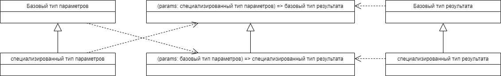

# Специализация результата

Давайте понаблюдаем за функциями.

```ts
type KnownLanguageName = 'Sanskrit'|'Latin';
declare const getWord: (language: KnownLanguageName)=> string;
declare const detectLanguage: (word: string)=>KnownLanguageName;
```

Функция `getWord` может вернуть в качестве значения слово, в том числе и слово Sanskrit и Latin. Но интереснее другое. Там, где мы можем использовать функцию `getWord`, скажем, в качестве колбэка, мы также можем использовать и функцию `detectLanguage`. Но не наоборот. Также заметьте, что параметру `word` можно присвоить любое значение, если его можно присвоить параметру `language`.

В TypeScript функции обладают этим интересным несимметричным свойством. Они «взаимозаменяемы» **наоборот** относительно взаимозаменяемости их параметров. Такое поведение системы типов называют _контра-вариацией_.

В отношении результата функции действует правило _ко-вариации_: если вместо одного типа функции можно использовать другой тип, то и результат ведёт себя так же. То есть вместо результата первого типа функции можно использовать результат второго типа функции.



Как быть, если нам нужно получить из функции специализированный тип данных? Нужно использовать перегрузку функций. Однако есть нюанс: в JavaScript нет перегруженных функций... В этой демонстрации мы рассмотрим «наилучшее» приближение к использованию перегруженных функций.

## Задача

Мы определяем функцию-посредника — middleware — которая будет добавлять имя CSS-класса к списку классов HTMLElement.

## Проблема в интерфейсе функции

При использовании различных HTML-элементов мы можем использовать базовый тип — HTMLElement — и применить значению этого типа CSS-класс темы. Но тогда результат работы функции теряет специфичность. Мы не можем, например, использовать его в сцепке с другими методами.

```ts
interface ThemeMiddleware{
  (element: HTMLElement): HTMLElement
}
```

## Демонстрация проблемы

В файле [модульного теста](https://codesandbox.io/s/infallible-perlman-3dht9?file=/src/theme-middleware.test.ts) видно, что TypeScript теряет информацию о специфичности элемента.

Особенность ситуации в том, что она существует только в TypeScript. Jest, исполняя результат JavaScript, проблемы не видит. 

Попробуем сделать так, чтобы и TypeScript помогал нам на этапе разработки.
