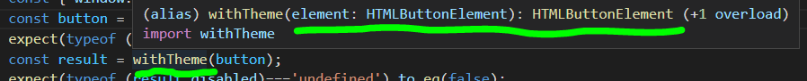

# Перегрузка функций

В TypeScript перегрузка функций декларируется в том числе с помощью сигнатуры вызова

```ts
export interface ThemeMiddleware {
  (element: HTMLButtonElement): HTMLButtonElement;
  (element: HTMLImageElement): HTMLImageElement;
}
```

## Проблема переехала.

Клиенский код, тот что в модульном тесте, теперь вполне счастлив.



Однако мы теперь получили [проблему реализации](https://codesandbox.io/s/step-2-demo-03-12-tv5ym?file=/src/theme-middleware.ts).

```terminal
Type '(element: HTMLButtonElement | HTMLImageElement) => HTMLButtonElement | HTMLImageElement' is not assignable to type 'ThemeMiddleware'.
  Type 'HTMLButtonElement | HTMLImageElement' is not assignable to type 'HTMLButtonElement'.
    Type 'HTMLImageElement' is missing the following properties from type 'HTMLButtonElement': disabled, form, formAction, formEnctype, and 12 more.ts(2322)
```

Как с ней поступить? Придется применить силу.

с кодом этого шага можно ознакомится [в песочнице](https://codesandbox.io/s/step-2-demo-03-12-tv5ym)

#
#
