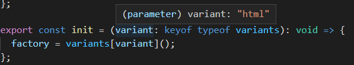

# Реализация функции init

Мы подготовили необходимый материал, чтобы реализовать функцию `init` вот таким образом

```ts
let factory: Factory | null = null;

const variants = {
  html: getHtmlFactory
};

export const init = (variant: keyof typeof variants): void => {
  factory = variants[variant]();
};
```

Конечно, в данный момент переменная `factory` еще не используется. Но обратите внимание на конструкцию [`variant: keyof typeof variants`](https://codesandbox.io/s/step-2-demo-03-16-module-3-05out?file=/src/control-provider.ts:191-221) она поручает TypeScript-у самостоятельно определить пересечение строковых специализированных литеральных типов, так сказать, по месту.



TypeScript изучает список ключей типа, извлеченного из константы и использует этот тип.
