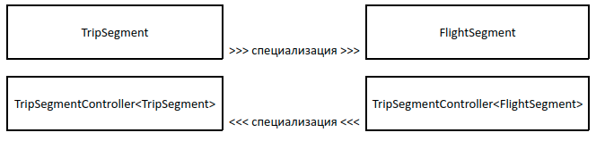

# Обобщенные функции, ко- и контра-вариантность функций

Мы выяснили, что TypeScript предоставляет возможность разработчику объявлять обобщенные структуры, и помним, что функции тоже имеют свои типы. Возникает вопрос о том, что и типы функций могут быть объявлены в общем виде. Это правда.

**Важно!** Для объявления функции обобщенного типа требуется указать формальные типы-переменные слева от открывающей скобки со списком аргументов.

```ts
// функция принимает два аргумента
// и возвращает один из них случайным 
// образом
function flip<T>(left: T, right: T): T {
    return Math.random() < 0.5 ? left : right;
}
```

или

```ts
// функция составляет массив из двух полученных аргументов
const makeTuple = function <T1, T2>(first:T1, second:T2):[T1,T2]{
    return [first,second];
}
```

или

```ts
// функция возвращает первый элемент массива
// если в массиве есть элементы
const getRealFirst = <T>(items:T[]):T=>{
    if(items.length>0){
        return items[0];
    }
    throw new RangeError('empty array');
};
```

## Реализация алгоритма в общем виде.

Функции обобщенного типа позволяют вынести общую часть алгоритма программы и сделать реализацию более модульной. Для каждого вида удаленного сервиса нужно сделать что-то похожее switch/case. При использовании механизма обобщенного программирования мы можем эту часть алгоритма написать только один раз.

```ts
function analyze<T>(response: ApiResponse<T>, client: Visitor<T>) {
    switch (response.status) {
        case 'error': {
            client.report(response);
            break;
        }
        case 'progress': {
            client.progress(response);
            break;
        }
        case 'success': {
            client.load(response);
            break;
        }
    }
}
```

Познакомьтесь с иллюстрацией в [песочнице](https://www.typescriptlang.org/play?removeComments=true&jsx=0&ssl=39&ssc=2&pln=24&pc=1#code/JYOwLgpgTgZghgYwgAgLIQM4bgcwgHgBUA+ZAbwChlrkMw4wBXDALmQHINGEkt2BuKjQAmDOG0KCAvhVCRYiFAEEADsACiUKAHso5IdToNmbdtB1QBB5AFtM2PGzpRQOaRVnho8JMgAKOjhQ9vo0tPRMrBwqgcF8gmFg2vQANmwgjDYARtAJItogEOmZOVDunvI+KABqwBjASVBEpJRhKdpwwgAUAG5wKYxF5Mii9BLIUgCUbD3awMJ51MEqumBd5rpsZLb2uEPOrhPTyLPzi8gx2kH2XUaQW8hJqcXZ0AA0IwVDGa96UzNzBYUGQUMAATxUyjUACVMCsQBgCCRkABeNC7PDNZAAH2Qqg0Wl0OP8sXsggoMEYIAQYGABWQcBA-TBAC8kcQunF4Yi2PjYRhueyPggUsAIOA2LV6o1mpNQjQMAB3BoIAAWyE5cIKiIAdHdmHLWmEaAg4IiOBtLFtrMaTaLxWAdctVpqBdqIJNzrbqFlgnAANZemgyb3IU3m9iXa58a2hsIisXgHVRuIYV2Cz0272+iABoPUEPe8MoTjcXgYdixuPUBMOnXtTrp92Z6s+v2BrMF6wyKRAA)

## Контравариантность функций

**Важно!** Функции бладают своством контравариативности относительно операции специализации типа-переменной для своих аргументов.

Если вдуматься, то это свойстово вполне резонно. Но сначала иллюстрация с использование двух типов

```ts
// у каждого этапа путешествия есть дата старта 
// и дата завершения
interface TripSegment{
    dateFrom: string;
    dateTo: string;
}

// FlightSegment специализирует TripSegment
interface FlightSegment extends TripSegment{
    laggage:number;
}
```

изучите два определения типа функций

```ts
// функция обобщенного типа имеет
// единственный аргрумент
type TripSegmentController<T> = (segment:T)=>void;

// в этой переменной тип-переменная воплощается
// более широким типом TripSegment
declare const controller: TripSegmentController<TripSegment>;

// в этой переменной тип-переменная вополщается 
// более специализированным типом FlightSegment
declare const manager: TripSegmentController<FlightSegment>;
```

функция `controller` готова принять в качестве параметра значения как типа TripSegment, так и типа FlightSegment. В то время как переменная `manager` не готова работать со значениями типа TripSegment (ведь у них нет свойства laggage)

Кроме прочего, это означает, что 

```ts
const b1:TripSegmentController<TripSegment> = manager;
//    ^^
//Type 'TripSegmentController<FlightSegment>' is not assignable to type 'TripSegmentController<TripSegment>'.
//  Property 'laggage' is missing in type 'TripSegment' but required in type 'FlightSegment'.

// ОК
const b2:TripSegmentController<FlightSegment> = controller;
```

т.е. переменной типа TripSegment можно присвоить значение типа FlightSegment. а переменной типа TripSegmentController&lt;FlightSegment> можно присвоить значение типа TripSegmentController&lt;TripSegment>




[Песочница](https://www.typescriptlang.org/play?removeComments=true&jsx=0#code/JYOwLgpgTgZghgYwgAgCpWABwMoQOYC2E4A3gFDKXIAmckAYlAPYEBcyAzmBiHgNwUqtSKibsuPfmQC+ZMqEixEKegBtgeABZhchYmGQQAHpBDUOaDDnxFSgyqrh48TiKxABXAgCNoA2WRgAJ6YKOhYurZgAMJM4MyqqtAAPKgAfMgAvMgAFBw2+qyoAJSZaQBuTMDUAmTUEAiOUCgIcVzIrfFMidDs4dZ64LFdPVCpVpH6aQL1jXDNHW0GBHAgrlB9EwVDcdzdSWNqGtqT4NNyne3eAIxFW4MxuwkH4xHbYBnZK2t4fmQA9P8qMgAHoggH-VAhFAAcn6p0eIxeRy0OneaRhyGAFhATAMcA4HA0a28SWQYCY5OhyDh9yiwz2o1eAyiGIAdBDKAAFZihKDBGmOZyuTHY5AEbFE3hYkBU0I0+HvTHeDwGZoARw8wGa1BlcthKJOSo5nMAeCCALBAyJcDN4AEx3N4PBnPFKGtEPT6LJF+IA) позволяет в этом убдеться

## Ковариативность функций

Функции обобщенных переменных ковариантны относительно операции специализации своего результата.

```ts
type RandomNumberProvider<T> = ()=>T;

declare const atomic: RandomNumberProvider<number>;
declare const coin:RandomNumberProvider<1|2>;

const a2:RandomNumberProvider<number> = coin;
const a1:RandomNumberProvider<1|2> = atomic;
//    ^^
//Type 'RandomNumberProvider<number>' is not assignable to type 'RandomNumberProvider<1 | 2>'.
//  Type 'number' is not assignable to type '1 | 2'.
```

[Песочница](https://www.typescriptlang.org/play?removeComments=true&jsx=0&ssl=10&ssc=53&pln=1&pc=1#code/C4TwDgpgBASghgOwCYHsC2A5ArmgRhAJwAUCUA3ASyUIB4AVAPigF4oAKASmYboG4AoftQDGAGzgFowlAgDOwKHGDoKwgFyxEqTDnzFSlagRoJdhBgJHjJUaXIXSKCNfGTpseQiXJVaARgAfACYLQTt5RSCXLXczfR8jEzimVkcEAXCFOD9otx1PeMN-YJTFZTRVAQB6Kqg6qAA9Bv4aunBoAHJXbQ89byLjUwKGDqgKWSgEFCzZWQoAcwQ4XFFoZShQSCgumPy+g19jPygAqBCOgDoW2qg2rY6hvVHxyenFWYWllbWUDfbt46nIKXIA) позволяет убедиться в этом.

## Специализация функций

То что функции ведут себя по разному делает задачу по описанию специализированных функций интереснее. По отношению к вариациям типов своих аргументов функции контравариантны, а по отношению вариации своих результатов - ковариантно.

Эти особенности функций проявляются при разработке функций обратного вызова.

Когда у нас есть массив авиа-сегментов, мы можем найти какой максимальный вес багажа мы можем взять, найти зачение минимальное среди всех сегментов.

```ts
const flights:FlightSegment[] = [];

const minReducer = (min:number, filght:FlightSegment)=>filght.laggage<min?filght.laggage:min;
const minLaggage = flights.reduce(minReducer,0);
```

а можем ли мы подать в качестве редуктора функцию, у которой аргумент не FlighSegment, а более широкий TripSegment?

```ts
// подойдет ли этот редуктор для 
// получения полного времени путешесвтия по воздуху?
const totalReducer = (total:number, segment:TripSegment)=>total+(new Date(segment.dateTo).valueOf()-new Date(segment.dateFrom).valueOf());
```

Если не догадались, загляните в [песочницу](https://www.typescriptlang.org/play?removeComments=true&jsx=0#code/JYOwLgpgTgZghgYwgAgCpWABwMoQOYC2E4A3gFDKXIAmckAYlAPYEBcyAzmBiHgNwUqtSKibsuPfmQC+ZMqEixEKegBtgeABZhchYmGQQAHpBDUOaDDnxFSgyqrh48TiKxABXAgCNoA2WRgAJ6YKOhYurZgAMJM4MyqqtAAPKgAfMgAvMgAFBw2+qyoAJSZaQBuTMDUAmTUEAiOUCgIcVzIrfFMidDs4dZ64LFdPVCpVpH6aQL1jXDNHW0GBHAgrlB9EwVDcdzdSWNqGtqT4NNyne3eAIxFW4MxuwkH4xHbYBnZK2t4fmQA9P8qMgAHoggH-VAhFAAcn6p0eIxeRy0OneaRhyGAFhATAMcA4HA0a28SWQYCY5OhyDh9yiwz2o1eAyiGIAdBDKAAFZihKDBGmOZyuTHY5AEbFE3hYkBU0I0+HvTHeDwGZoARw8wGa1BlcthKJOSo5nMAeCCALBAyJcDN4AEx3N4PBnPFKGtEPT6LJF-C5LZAwdSojisN0IgDaAF0sshI7VreLQAAlCDUDxIKDRnISkDuLy+KAAGn9wFUqJDgaND1KaRgJdRbKFLl+yWzAH5a6XtA2nE23NmBPHswAZHuuaMB45gDhsnVpiBZpMpueFgAMxTjfopYDgqmTqfTma3O9zPmgRfyDwdLP01aPqgA1DkQBAAO7IAAidHnF6ibOEEFEYo2XKHcPAgAB5GAcmKABaZ830-SA8neP8v0YFggJA1QwMg6D119EB2jAYBt1UN1UGAIhxwrKcZyXJAcjvPdlwLNc+CAA)
