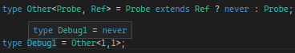
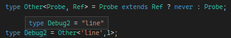

# Условные типы

TypeScript — проект открытого кода. Разработчики, использующие TypeScript, своими [замечаниями и пожеланиями](https://github.com/microsoft/TypeScript/issues) определяют направление его развития. [Ryan Cavanaugh](https://twitter.com/SeaRyanC/status/1029846761718702081), один из разработчиков TypeScript, как-то заметил, что если существует единственная вещь, способная помочь в работе с TypeScript, то это **условные типы**. 

С ними мы сейчас и познакомимся.

## Параллель

Предлагаем изучить и сравнить два кусочка кода. Следите за ключевыми словами `const` и `type`:

```javascript
const former = 7*2;
const latter = 7;
const result = latter < former ? 'correct' : 'wrong';
```

В третьей строке используется условный оператор. Сравним его с приведённым ниже выражением для типов.

```typescript
type Former = 7|2
type Latter = 7

type Result = Latter extends Former? 'correct' : 'wrong';
```

Для вас очевидно, что значением константы `result` будет строка 'correct'. Интуиция подсказывает: что-то подобное произойдёт и со значением типа `Result`. Откройте код в [песочнице](https://www.typescriptlang.org/play?#code/MYewdgzgLgBAZiATgWwKaJgXhgdgFQBMA3AFCiSwA2AhlFOlrqWeNDIqhAK6WzY10GAHnhI0GAPwwA5KEQdgUaTABcMgO6JwAc2nMoATwAOqGADExDbDgA+BEoZMwAMrXoZrJB8dMAlTjx8Lm4MqAAe9GAAJhDmlohSMnIKSqoaWmC6REA) и наведите мышкой на символ `Result`.

Синтаксис условного типа похож на тернарный оператор.

* Значение типа Result будет зависеть от сравнения типов `Latter` и `Former`.
* Если `Latter` является специализацией `Former` (переменной типа `Former` можно присвоить значения типа `Latter`), то результатом будет тип, стоящий после `?` — на месте true-результата.
* Если `Latter` не является специализацией `Former`, то выбирается тип, стоящий после `:` — на месте false-результата.

Проверьте себя:

```ts
type Debug = 2 extends number ? boolean : string;
```

Тип `Debug` эквивалентен `boolean`.

```ts
const items = ['']
export const length: (
    (typeof items) extends { length: number }
    ? number
    : never
) = 0;
```

Приведённый выше код компилируется без ошибок. Давайте проследуем за компилятором и выясним, что происходит.

1. Вычисления типа начинаются со внутренней скобки `(typeof items)`. Значением этого выражения будет тип `string[]` — массив строк. Мы обозначим этот тип T1.
2. Также обозначим тип `T2 = {length: number}` — тип, у которого есть числовое  свойство `length`.
3. Далее компилятор проверяет, является ли тип T1 специализацией типа T2. Можно переформулировать: есть ли у значений типа T1 числовое свойство `length`. По тексту программы видно, что такое свойство есть.
4. Компилятор выбирает одну из веток тернарного оператора `(Condition)?(OnTrue):(OnFalse)`. Из пункта №3 следует, что выбирается ветка (OnTrue). В этой ветке указан тип `number`.
5. В результате вычислений условий и значений типов, указанных в разных ветках, компилятор приходит к выводу, что значение внешних скобок (тип переменной `length`) эквивалентно типу `number`.
6. Переменной типа `number` можно присвоить значение `0`, и программа компилируется без ошибок.

Таким образом, компилятор и сервисы TypeScript в редакторе обеспечили контроль намерений разработчика по использованию значений в переменной `length`. А свои намерения разработчик высказал в виде «программы на типах».

## Обобщённые условные типы

Выражение условного типа — это оператор ветвления (если — то, иначе — другое). При этом компилятор выполняет предписанные действия во время компиляции, а редактор выполняет их по мере того, как вы пишете код. Это особенно удобно при написании коротких программ для вычисления типа при одном или нескольких заданных других типах.

Первая программа на типах TypeScript позволит нам вычислить новый тип, который является специализацией первого первого дженерик-параметра `Probe`, но при этом полностью исключает другой тип (`Ref`).

```ts
type Other<Probe, Ref> = Probe extends Ref ? never : Probe;
```

Мы назвали «программу» `Other`. Она работает, выполняя вычисления над исходной информацией из двух частей. Первая часть — первый тип-параметр `Probe`. Это тип, который мы будем исследовать. Второй тип-параметр — `Ref`. Это опорные данные.

Программа работает так: если входящий тип является специализацией опорного, то он заменяется на тип `never`, если же входящий тип не является специализацией опорного, то используется сам входящий тип.

Проверим нашу «программу» на эквивалентных типах:

```ts
type Debug1 = Other<1,1>;
```



А теперь проверим на заведомо разных типах:

```ts
type Debug2 = Other<'line',1>;
```

;

## Дистрибутивный условный тип

Когда тестируемый тип в условном типе используется без дополнительной структуры, условный оператор становится дистрибутивным. В результате поведение программы становится очень полезным.

```ts
type TrafficLights = 'red' | 'yellow' | 'green';
type StopLights = 'red' | 'yellow';

type GoLights = Other<TrafficLights, StopLights>
```

На первом шаге все составные элементы объединения TrafficLights используются отдельно:

```ts
type GoLights_Step1 = 
  Other<'red', StopLights>
  | Other<'yellow', StopLights>
  | Other<'green', StopLights>

```

На следующем шаге вычислений мы видим объединение результатов:

```ts
type GoLights_Step2 = 
  never
  | never
  | 'green'

```

Наконец, объединение с типом never не изменяет ничего в системе типов, и never опускается вовсе.

```ts
type GoLights_Step3_Final = 'green'

```

Проверьте результат в [песочнице](https://www.typescriptlang.org/play?#code/FAFwngDgpgBA8iAFlATgHgAooPYCMoA0MASlAGYB8MAvDFnrFAB4hQB2AJgM4nkwD8MNlABuqGAC46OfAG5goSLAAqKAIZkyASwDGAGS0BzRCB60A5CigdzMAD4xzYKABsX2AO62H5w1fbm8uDQMADKINgQBsamNI5WNvaOzm6egQrBsADi2NEmZvBIqGiqGtr6RvlE4ZF5phTAQA).

> Использование такого условного типа настолько распространено, что TypeScript предоставил эту реализацию в составе библиотеки, что называется «из коробки» — смотрим `Exclude`.

В составе TypeScript больше дюжины таких утилитарных, часто используемых условных типов.

* Partial&lt;Type>
* Required&lt;Type>
* Readonly&lt;Type>
* Record&lt;Keys, Type>
* Pick&lt;Type, Keys>
* Omit&lt;Type, Keys>
* Exclude&lt;UnionType, ExcludedMembers>
* Extract&lt;Type, Union>
* NonNullable&lt;Type>
* Parameters&lt;Type>
* ConstructorParameters&lt;Type>
* ReturnType&lt;Type>
* InstanceType&lt;Type>
* ThisParameterType&lt;Type>
* OmitThisParameter&lt;Type>
* ThisType&lt;Type>

Все они используют библиотечные реализации, похожие на нашу `Other`.

## Ключевое слово infer

Для создания программ вы используете переменные. При создании программ на типах для вычисления типов (условных типов) переменные обозначаются ключевым словом infer. Это ключевое слово может использоваться в условии, то есть до знака `?`, и имеет значение только при выполнении условия, то есть между `?` и `:`. Несмотря на такие ограничения, это очень сильная возможность.

Вот как она используется для создания типа `ReturnType`:

```ts
 type ReturnType<T extends (...args: any) => any> = T extends (...args: any) => infer R ? R : any;
```

В этом условном типе указано, что на вход можно подать тип любой функции: `<T extends (...args: any) => any>`.

Далее производится анализ и назначается временная переменная `R`. Читается `T extends (...args: any) => infer R`: если входной тип является функцией, то обозначим тип её результата `R`.

Далее программа «возвращает» результат вычисления: либо `R`, либо `any`.

В следующем разделе мы познакомимся со способом организации циклов при вычислении типов в TypeScript. После этого вы сможете самостоятельно написать выражения для таких условных типов, как `Pick<Type, Keys>` или многих других.
