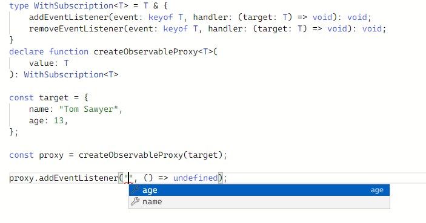

# Интерполяция строковых литеральных типов

## Интерполяция строковых типов

Предположим перед нами задача для простых javascript-объектов данных создавать прокси. Наш прокси должен позволять заинтересованным функциям подписаться на изменения полей объекта. Компилятор TypeScript позволяет выполнить задачу безопасным образом.

```typescript
type WithSubscription<T> = T & {
    addEventListener(event: keyof T, handler: (target: T) => void): void;
    removeEventListener(event: keyof T, handler: (target: T) => void): void;
}
```

В вышеприведенном примере мы воспользовались оператором keyof. Мы применили его к типу, который, как мы объяснили компилятору, нам будет известен позднее. Компилятор запоминает этот новый тип и в дальнейшем подсказывает, если мы его используем.

Ниже мы воспользуемся этим типом и объявим функцию. Эта функция, как мы планируем, будет получать структурный объект, производить над ним магические действия и возвращать новый объект. У нового объекта будут те же свойства, что и у исходного. Дополнительно у него появится два метода для подписывания и отмены подписки.

```typescript
declare function createObservableProxy<T>(
    value: T
): WithSubscription<T>
```

Вот так нашим api можно будет пользоваться.

```typescript
const target = {
    name: "Tom Sawyer",
    age: 13,
};

const proxy = createObservableProxy(target);

proxy.addEventListener("age", () => undefined);

```

Вы можете проверить в песочнице. Редактор действительно будет вам подсказывать, на какие события можно подписаться.



## Полезные операции со строковыми типами

Компилятор предоставляет нам очень удобный инструмент для изменения имен полей и для манипуляции строковыми типами.

В рассмотренном примере, было бы красиво называть событие не "name" или "age", а как-то более привычно, "onNameChanged" например. И этого можно достичь. 

```typescript
type WithSubscription<T> = T & {
    addEventListener(event: `on${Capitalize<string & keyof T>}Changed`, handler: (target: T) => void): void;
    removeEventListener(event: `on${Capitalize<string & keyof T>}Changed`, handler: (target: T) => void): void;
}
```

**Полезно!** Компилятор предоставляет ряд полезных типов для манипуляции строковыми типами.

* Uppercase&lt;StringType>: тип `type A1 = Uppercase<"name">` эквивалентен `type A2 = "NAME"`,
* Lowercase&lt;StringType>: тип `type A1 = Lowercase<"NAME">` эквивалентен `type A2 = "name"`,
* Capitalize&lt;StringType>: тип `type A1 = Capitalize<name>` эквивалентен `type A2 = "Name"`,
* Uncapitalize&lt;StringType>: тип `type A1 = Uncapitalize<"NAME">` эквивалентен `type A2 = "nAME"`

Попробуйте в песочнице заменить описание типа WithSubscription и изучить, какие названия для событий *придумает* компилятор.