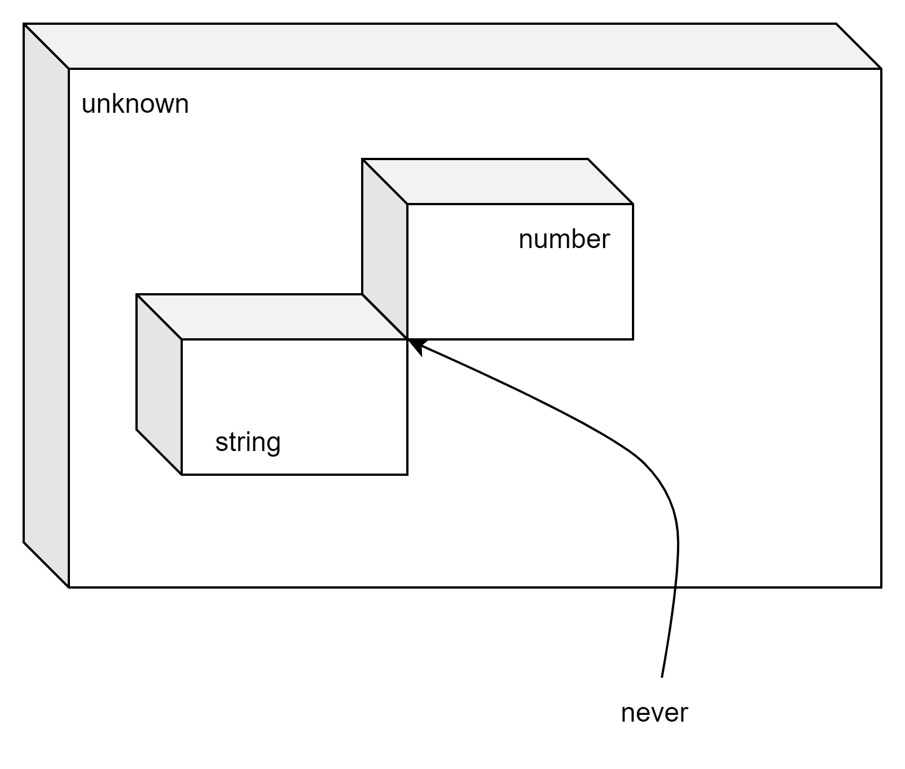

# Обобщенное программирование

## Теория типов

Для наших целей тип это вывеска на коробке. На вывеске написано название типа, а внутри коробки лежат элемент - все возможные значения типа

* В коробке с названием *number* лежат значения, которые определены стандартом IEEE-754 (кроме Infinity, NaN)
* В коробке с названием *string* лежат строки. Их там бесконечно много.
* В коробке boolean - два элемента.
* и т.д.

## Операции с типами

Возьмем коробку побольше и объединим в ней содержимое наших *string* и *number*. Взболтаем и перемешаем.

Элемент, который мы можем вытащить из этой большой коробки может быть числом или строкой.

Коробка стала "шире", но чтобы поработать с каким либо значением из этой коробки сначала приходится уточнять что нам попалось на этот раз - число или строка.

**Внимание!** Чтобы описать объединение нескольких типов,  TypeScript  применяет оператор `|`. Синтаксис: `string | number`

Можно представить другую ситуацию. Нам нужны такие значения, которые одновременно находятся в двух или нескольких коробках. Множество таких значений пересечение исходных множеств доступных значений. Подумайте, результатом после вызова функции encounterFlyingDutchman будут не все жители Нидерландов, а только летучие голландцы.

```typescript
type Flying = {
    fly():void,
};
type Fish = {
  swim():void,
};
type Saucer = {
    holdJam():void;
}
type Dutchman = {
    moveToAmsterdam():void;
}

declare function getFlyingFish():Flying & Fish;
declare function detectFlyingSaucer(): Flying & Saucer;
declare function encounterFlyingDutchman(): Flying & Dutchman;

getFlyingFish().fly();
detectFlyingSaucer().fly();
encounterFlyingDutchman().moveToAmsterdam();
```

**Внимание** Если мы хотим потребовать от TypeScript такой новый тип, значения которого одновременно являются значениями нескольких других, мы используем синтаксис `string & number`.

* читайте `type n = a | b` как: новый тип значения которого являются либо значениями типа `a` либо значениями типа `b`
* читайте `type n = a & b` как: новый тип `n` такой, что любое значение этого типа является одновременно значение и типа `a` и типа `b`.

Как бы вы прочитали 

```typescript
type n = (string | number) & string;
```

## Единичные элементы системы типов

Помните, при сложении чисел есть одно, специальное число 0. такое, что его можно добавлять к любому другому числу, но ничего не поменяется. При умножении есть другое специальное число 1. Эти числа еще называют - единичными элементами. У TypeScript есть две специальные коробки - их названия - unknown и  never.

тип unknown работает единичным элементом для операции объединения

```typescript
  T & unknown => T
```

Коробка с именем unknown самая широкая, но зато на ней пустой список операций. Ничего мы не может сделать с этим типом. Ну разве что `typeof` выяснить.

Тип never работает единичным элементом для операции пересечения

```typescript
  T | never => T
```

Коробка с этим типом самая узкая - в ней нет никаких элементов. Немудрено, что с любым элементом (из нуля) элементов можно совершать любые операции. Такая уж математика.



## Встречаем обобщенное программирование

Когда TypeScript гарантирует нам что со значениями того или иного типа можно делать оговоренные действия мы можем создавать процедуры, которые заранее не определяют конкретный тип. Обобщенное программирование эксплуатирует понятие совместимости типов.

Совместимость типов в TypeScript основана на структурной эквивалентности принятой в javascript. Этот подход отличает TypeScript от статически типизированных языков - Java, C# и других. В частности в TypeScript допускается использование следующей специализации

```typescript
type Dancer = {
  specialty: "ballet" | "acrobatic rock&roll" | "lindy hop"
}

let prime: Dancer;

const student = {
    specialty: "ballet",
    name: "Peppa Pig",
} as const;

prime = student;
```

Переменная `student` неявно получила класс с двумя ключами - specialty и name и по принципу структурности Javascript может быть использована в любом месте, где может быть использована переменная prime.

Вооруженные этим знанием мы можем создать первую обобщенную программу.

```typescript
// функция вернет первый элемент массива. 
// Его тип и значение будет известно потом. 
// сейчас важно, что набор элементов это массив
function firstItem<T>(array:T[]):T{
  if(array.length>0){
    return array[0];
  }
  throw new Error("empty array");
}
```

Имея описание такой функции мы можем опереться на компилятор и поручить ему убедиться, что после получения элементы мы сможем использовать значения по назначению

```typescript
const array1 = [42,73];
const theAnswer = firstItem(array1);
// typeof theArray === "number";
// мы может использовать значение безопасно
Math.abs(theAnswer); //ok
theAnswer.split(","); //Property 'split' does not exist on type 'number'.(2339)

```

Возможности обобщенного программирования делают TypeScript очень мощным инструментом и мы регулярно  будет использовать их в работе.
