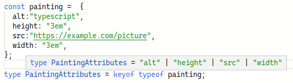
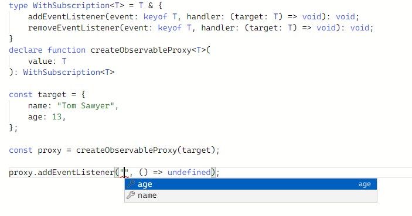

# Строковые шаблоны при описании типов

## Строковые типы

**Важно!** В примерах кода обращайте внимание на контекст. Идет ли речь о типах, как здесь: `type Name ...` или о значениях `const name ...`. Помните, что typescript работает с типами до окончания компиляции, в браузере javascript о них ничего не знает.

Мы продолжаем использовать знания об арифметике типов. Компилятор позволяет нам описать такой тип, который почти строка. Однако значения этого типа могут содержать не всё бесконечное количество строк, а только конкретный набор.

```typescript
type AppKey = "APP-XX-44";
const wrongKey:AppKey = ""; //Type '""' is not assignable to type '"APP-XX-44"'.(2322)
```

В переменной типа `AppKey` мы сможем сохранить значения которые удовлетворяют ограничениям: *представляют из себя строку* **APP-XX-44**. В то же время следующие описания и инициализации работают без ошибок.

```typescript
type Attributes = 'src'|'alt'|'width'|'height';
const src:Attributes = 'src';
const alt:Attributes = 'alt';
const width:Attributes = 'width';
const height: Attributes = 'height';
```

Дальше в этой главе мы рассмотрим встроенные обобщенные типы. Тогда мы разберем, чем похожи и чем отличаются два следующих определения типов

```typescript
type Picture = Record<Attributes, string>;
type Painting = {
  src: string,
  alt: string,
  width: string,
  height: string,
};

const a:Painting = {
  alt:"typescript",
  height: "3em",
  src:"https://example.com/pictuer",
  width: "3em",
};
const b: Picture = a;

```

## operator keyof

Компилятор typescript позволяет создать новый тип, зная определенный структурный тип. Новый тип содержит в себе все строки, которые "раньше" были названиями полей нашего структурного типа. А тип, можно выяснить с помощью оператора typeof.

```typescript
const painting =  {
  alt:"typescript",
  height: "3em",
  src:"https://example.com/picture",
  width: "3em",
};
type PaintingAttributes = keyof typeof painting;
```

Тип PaintingAttributes полностью эквивалентен типу Attributes, который мы создали вручную.



## Интерполяция строковых типов

Все операции с типами выполняются во время работы компилятора. Это позволяет описывать типы динамически. 

Предположим перед нами задача для простых javascript-объектов данных создавать прокси. Наш прокси должен позволять заинтересованным функциям подписаться на изменения полей объекта. Компилятор typescript позволяет выполнить задачу безопасным образом.

```typescript
type WithSubscription<T> = T & {
    addEventListener(event: keyof T, handler: (target: T) => void): void;
    removeEventListener(event: keyof T, handler: (target: T) => void): void;
}
```

В вышеприведенном примере мы воспользовались оператором keyof. Мы применили его к типу, который, как мы объяснили компилятору, нам будет известен позднее. Компилятор запоминает этот новый тип и в дальнейшем подсказывает, если мы его используем.

Ниже мы воспользуемся этим типом и объявим функцию. Эта функция, как мы планируем, будет получать структурный объект, производить над ним магические действия и возвращать новый объект. У нового объекта будут те же свойства, что и у исходного. Дополнительно у него появится два метода для подписывания и отмены подписки.

```typescript
declare function createObservableProxy<T>(
    value: T
): WithSubscription<T>
```

Вот так нашим api можно будет пользоваться.

```typescript
const target = {
    name: "Tom Sawyer",
    age: 13,
};

const proxy = createObservableProxy(target);

proxy.addEventListener("age", () => undefined);

```

Вы можете проверить в песочнице. Редактор действительно будет вам подсказывать, на какие события можно подписаться.



## Полезные операции со строковыми типами

Компилятор предоставляет нам очень удобный инструмент для изменения имен полей и для манипуляции строковыми типами.

В рассмотренном примере, было бы красиво называть событие не "name" или "age", а как-то более привычно, "onNameChanged" например. И этого можно достичь. 

```typescript
type WithSubscription<T> = T & {
    addEventListener(event: `on${Capitalize<string & keyof T>}Changed`, handler: (target: T) => void): void;
    removeEventListener(event: `on${Capitalize<string & keyof T>}Changed`, handler: (target: T) => void): void;
}
```

**Полезно!** Компилятор предоставляет ряд полезных типов для манипуляции строковыми типами.

* Uppercase&lt;StringType>: тип `type A1 = Uppercase<"name">` эквивалентен `type A2 = "NAME"`,
* Lowercase&lt;StringType>: тип `type A1 = Lowercase<"NAME">` эквивалентен `type A2 = "name"`,
* Capitalize&lt;StringType>: тип `type A1 = Capitalize<name>` эквивалентен `type A2 = "Name"`,
* Uncapitalize&lt;StringType>: тип `type A1 = Uncapitalize<"NAME">` эквивалентен `type A2 = "nAME"`

Попробуйте в песочнице заменить описание типа WithSubscription и изучить, какие названия для событий *придумает* компилятор.

