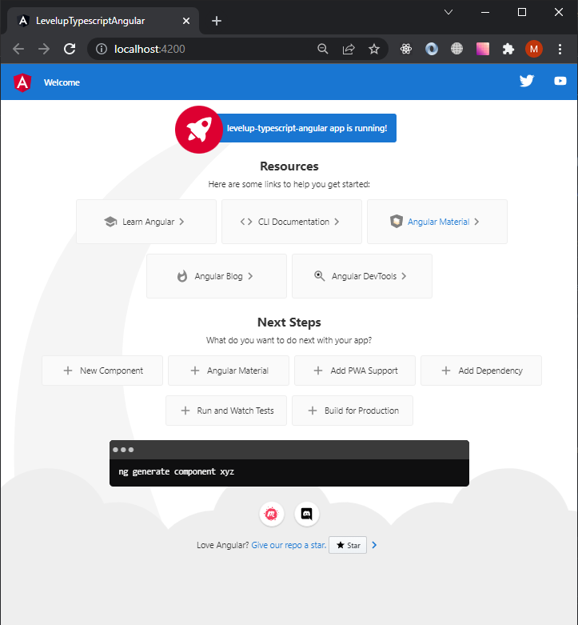

# Запуск приложения Angular

Запускаем приложение Angular в режиме разработки:

```terminal
npm run start
```

После непродолжительной подготовки вы увидите:

```terminal
PS D:\sources\html-academy\courses\levelup-typescript> npm  run start

> levelup-typescript-angular@0.0.0 start
> ng serve

✔ Browser application bundle generation complete.

Initial Chunk Files   | Names         |  Raw Size
vendor.js             | vendor        |   1.69 MB |
polyfills.js          | polyfills     | 299.99 kB |
styles.css, styles.js | styles        | 173.72 kB |
main.js               | main          |  51.49 kB |
runtime.js            | runtime       |   6.55 kB |

                      | Initial Total |   2.21 MB

Build at: 2022-02-09T11:47:28.999Z - Hash: 43967de193384f7c - Time: 5385ms

** Angular Live Development Server is listening on localhost:4200, open your browser on http://localhost:4200/ **


√ Compiled successfully.
```

Можете отправить свой браузер по адресу [http://localhost:4200/](http://localhost:4200/) и увидите картинку, похожую на: 


