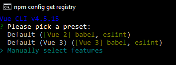
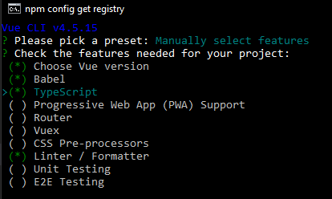

# Инструменты разработки

Пакет Vue приходит к вам в виде инструментов, которые можно установить

```terminal
npm install --global @vue/cli
```

С помощью этих инструментов вы можете инициализировать новый проект и потребовать от Vue использование TypeScript. Используйте Manual Select Features.

```terminal
vue create levelup-typescript-vue
```



В первом вопросе добавьте пункт TypeScript, а ответы на остальные вопросы можете оставить по умолчанию



В результате у вас появится папка levelup-typescript-vue
