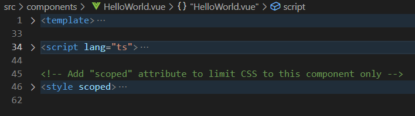

# Vue-система

Заготовка приложения Vue содержит ряд знакомых файлов, таких как `tsconfig.json`, а также компоненты `.vue`.

А где же TypeScript? 

Изучим файл `src\components\HelloWorld.vue`.

На 34 строке вы видите тег `<script>` с атрибутом я `lang="ts"` — это модуль TypeScript.

В документации вы можете более подробно ознакомиться с особенностями использования TypeScript, возможностями определения типов и другими нюансами.

Если вы работаете в VS-Code, для удобства установите расширение: [https://marketplace.visualstudio.com/items?itemName=octref.vetur](https://marketplace.visualstudio.com/items?itemName=octref.vetur).
