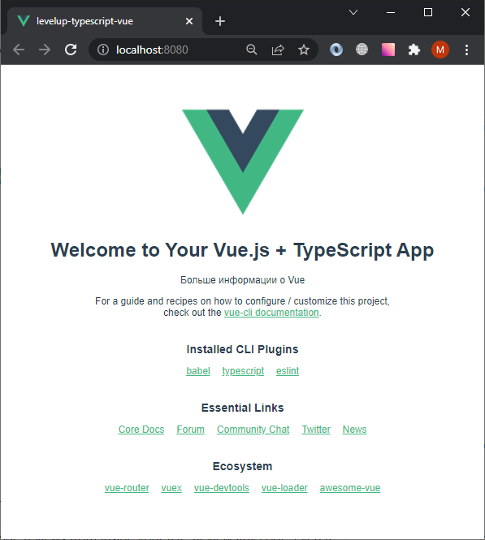

# Эксперименты с Vue

Измените TypeScript в файле `src\components\HelloWorld.vue`

```ts
import { defineComponent } from 'vue';

export default defineComponent({
  name: 'HelloWorld',
  props: {
    msg: String,
    details: String,
  },
});

```

Добавьте разметку в файл `src\components\HelloWorld.vue`

```html
<section>{{details}}</section>
```

добавьте атрибут в файл `src\App.vue`

```html
<template>
  
  <HelloWorld 
  msg="Welcome to Your Vue.js + TypeScript App"
  details="Больше информации о Vue"
  />
</template>
```

Убедитесь, что вы видите в браузере внесенные вами изменения


